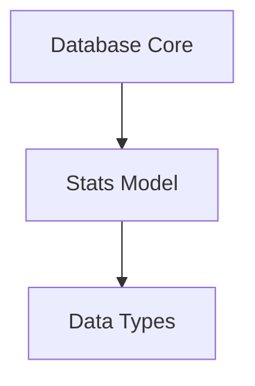

# `stats_schema` Module Documentation

## Introduction

The `stats_schema` module defines the data model for storing workload statistics within the system's database. It provides the `Stats` GORM model, which represents a single record of aggregated metrics and configuration overrides for a specific workload in a cluster.

## Architecture and Component Relationships

This module is a leaf module within the `database_schemas` hierarchy, specifically focusing on the schema definition for statistical data. Its primary component is the `Stats` model, which is used by the `database_core` to interact with the underlying database.

The `Stats` model contains serialized data (typically JSON strings) that adhere to structures defined in the `data_types` module, providing a consistent way to store complex statistical information and override configurations.

<!-- DIAGRAM_JSON
{
    "direction": "TD",
    "nodes": [
        {"id": "stats_model", "label": "Stats Model", "type": "component", "link": null},
        {"id": "database_core", "label": "Database Core", "type": "external", "link": "database_core.md"},
        {"id": "data_types_module", "label": "Data Types", "type": "external", "link": "data_types.md"}
    ],
    "edges": [
        {"source": "database_core", "target": "stats_model"},
        {"source": "stats_model", "target": "data_types_module"}
    ],
    "groups": []
}
-->



### Core Components

#### `pkg.adapters.database.models.Stats`

```go
type Stats struct {
	ID          uint      `gorm:"column:id;primaryKey;autoIncrement"`
	ClusterID   string    `gorm:"column:cluster_id;index;"`
	WorkloadID  string    `gorm:"column:workload_id;index;"`
	Stats       string    `gorm:"column:stats"`
	GeneratedAt time.Time `gorm:"column:generated_at;index"`
	CreatedAt   time.Time `gorm:"column:created_at;autoCreateTime"`
	UpdatedAt   time.Time `gorm:"column:updated_at;autoUpdateTime;index"`
	Overrides   string    `gorm:"column:overrides;default:'{}'"`
}
```

This Go struct defines the database model for storing workload statistics. Key fields include:
- `ID`: Unique identifier for the statistics record.
- `ClusterID`: Identifier of the cluster to which the workload belongs.
- `WorkloadID`: Identifier of the specific workload.
- `Stats`: A string field (expected to be JSON) containing the detailed statistical data for the workload. This data typically conforms to types defined in the [data_types module](data_types.md), such as `pkg.types.stats.WorkloadStat`.
- `GeneratedAt`: Timestamp indicating when the statistics were generated.
- `CreatedAt`, `UpdatedAt`: Standard timestamps for record creation and last update.
- `Overrides`: A string field (expected to be JSON) containing any override configurations applied to the workload, also conforming to structures in the [data_types module](data_types.md).

## System Integration

The `stats_schema` module plays a crucial role in the system by providing the persistent storage definition for critical workload performance and configuration data. It is integrated as follows:

- **Database Interaction**: The `Stats` model is utilized by the [database_core module](database_core.md) to perform CRUD operations, allowing the system to save, retrieve, and manage workload statistics.
- **Data Generation**: Modules responsible for generating statistical data, such as tasks within `task_implementations` (e.g., `taskCreateStats`), will populate instances of this `Stats` model before they are persisted to the database.
- **Data Consumption**: Other parts of the system, including potentially the `recommender_client` or various API handlers, will query and consume data structured according to this schema to make informed decisions or display information.
- **Schema Hierarchy**: It is part of the broader [database_schemas module](database_schemas.md) which groups all database schema definitions, ensuring a clear separation of concerns within the data layer.

This module ensures that workload statistics are consistently structured and stored, forming the foundation for analysis, recommendations, and operational insights across the platform.