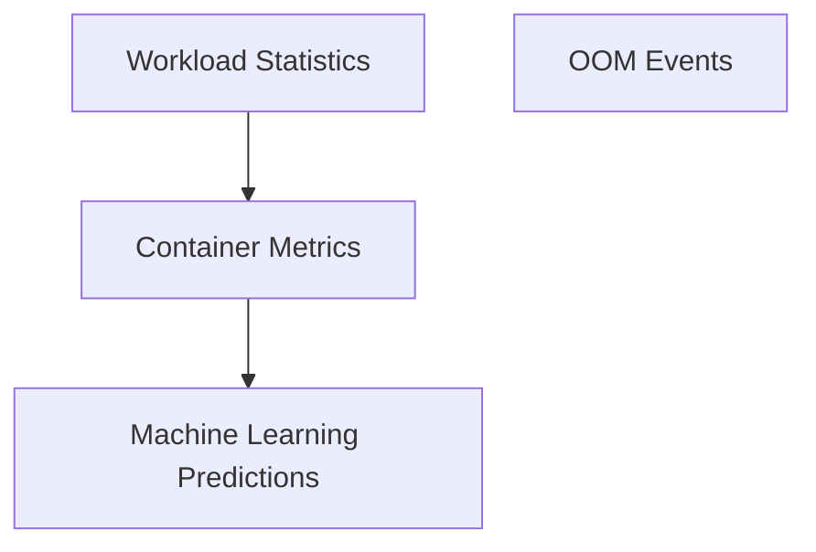

# Stats Types Module

## Introduction

The `stats_types` module defines the core data structures used throughout the system for handling and reporting various statistics related to workloads, containers, and resource usage. These types are fundamental for capturing, processing, and presenting performance and resource optimization data, including raw metrics, machine learning predictions, and Out-Of-Memory (OOM) events.

## Architecture Overview

The `stats_types` module is composed of several key sub-modules, each focusing on a specific aspect of data representation. These sub-modules are designed to provide clear and organized structures for different categories of statistical information, enabling efficient data exchange and analysis across the system.

<!-- DIAGRAM_JSON
{
    "direction": "TD",
    "nodes": [
        {"id": "workload_statistics", "label": "Workload Statistics", "type": "module", "link": "workload_statistics.md"},
        {"id": "container_metrics", "label": "Container Metrics", "type": "module", "link": "container_metrics.md"},
        {"id": "machine_learning_predictions", "label": "Machine Learning Predictions", "type": "module", "link": "machine_learning_predictions.md"},
        {"id": "oom_events", "label": "OOM Events", "type": "module", "link": "oom_events.md"}
    ],
    "edges": [
        {"source": "workload_statistics", "target": "container_metrics"},
        {"source": "container_metrics", "target": "machine_learning_predictions"}
    ],
    "groups": []
}
-->

## Sub-modules

### [Workload Statistics](workload_statistics.md)
This sub-module defines data structures for aggregated workload statistics, including overall responses, individual workload details, constraints, overrides, and original resource configurations.

### [Container Metrics](container_metrics.md)
This sub-module encompasses data types for detailed container-level metrics, such as CPU and memory usage statistics, 7-day historical data, and PSI adjusted usage metrics.

### [Machine Learning Predictions](machine_learning_predictions.md)
This sub-module contains data structures for machine learning-derived predictions and percentiles related to CPU and memory, including PSI-adjusted values and simple prediction models.

### [OOM Events](oom_events.md)
This sub-module defines the structure for Out-Of-Memory (OOM) event records, capturing critical details like cluster, container, pod, node, namespace, timestamps, and memory usage at the time of the event.
