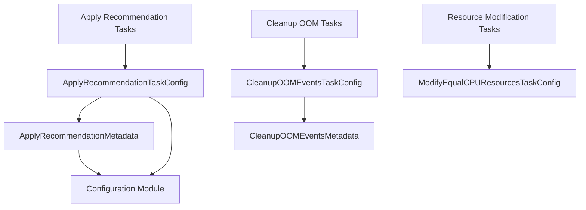

# task_configuration Module Documentation

## Introduction

The `task_configuration` module is a pivotal component responsible for defining the structural configurations of various automated tasks within the system. It centralizes the settings and parameters required for tasks such as applying resource recommendations, cleaning up Out-Of-Memory (OOM) events, and modifying CPU resources. By providing clearly defined configuration structures, this module enables precise control over task behavior, scheduling, and execution contexts.

## Architecture and Component Relationships

This module primarily consists of several configuration (`TaskConfig`) and metadata (`Metadata`) structures, each tailored to a specific task type. These structures encapsulate all necessary parameters for a task to function correctly.

### Core Components:

*   **`ApplyRecommendationTaskConfig`**: This structure defines the configuration for the task responsible for applying resource recommendations. It includes general task parameters like `Name`, `Enabled`, `Schedule`, `ClusterID`, `TargetClusterID`, `TargetNamespace`, and `IsClusterWriteAuthorized`. It also embeds `BasicAuthConfig` and `RecommendationSettings` from the [configuration module](configuration.md) and relies on `ApplyRecommendationMetadata` for task-specific details.

*   **`ApplyRecommendationMetadata`**: This nested structure within `ApplyRecommendationTaskConfig` holds specific metadata related to applying recommendations. Key fields include `DryRun` (for simulation mode), `NodeStatsURL`, `OverridesURL` (both referencing `config.URLConfig` from the [configuration module](configuration.md)), and `SkipMemory`.

*   **`CleanupOOMEventsTaskConfig`**: This configuration structure is used for tasks that clean up Out-Of-Memory events. It defines `Name`, `Enabled`, `Schedule`, `ClusterID`, and embeds `CleanupOOMEventsMetadata`.

*   **`CleanupOOMEventsMetadata`**: This metadata structure for `CleanupOOMEventsTaskConfig` specifies the `RetentionDays` for OOM event data, dictating how long events should be kept before being cleaned up.

*   **`ModifyEqualCPUResourcesTaskConfig`**: This configuration is used for tasks that modify CPU resources. It includes fields such as `Name`, `Enabled`, `Schedule`, `ClusterID`, and `IsClusterWriteAuthorized`.

These configuration structures act as data models that are consumed by the actual task implementations found in the [task_implementations module](task_implementations.md) (e.g., `ApplyRecommendationTask`, `CleanupOOMEventsTask`, `ModifyEqualCPUResourcesTask`). They ensure that each task executes with the correct operational parameters and adheres to the system's requirements.

## How the Module Fits into the Overall System

The `task_configuration` module is fundamental to the system's automated operations framework. It serves as the blueprint repository for defining how various tasks will behave and interact with different parts of the system. When a task is scheduled or triggered, the system retrieves its specific configuration from this module, which then guides the task's execution, targeting, and resource management.

This module provides the flexibility to configure tasks for different clusters, enable or disable them as needed, and set up recurring schedules. It ensures that tasks like applying recommendations or cleaning up OOM events are performed consistently and according to predefined policies. Its strong integration with the [configuration module](configuration.md) allows it to inherit global settings and with the [task_implementations module](task_implementations.md) to drive the actual execution logic, making it a critical link between system-wide settings and concrete automated actions.

<!-- DIAGRAM_JSON
{
    "direction": "TD",
    "nodes": [
        {"id": "apply_recommendation_task_config", "label": "ApplyRecommendationTaskConfig", "type": "component", "link": null},
        {"id": "apply_recommendation_metadata", "label": "ApplyRecommendationMetadata", "type": "component", "link": null},
        {"id": "cleanup_oom_events_task_config", "label": "CleanupOOMEventsTaskConfig", "type": "component", "link": null},
        {"id": "cleanup_oom_events_metadata", "label": "CleanupOOMEventsMetadata", "type": "component", "link": null},
        {"id": "modify_equal_cpu_resources_task_config", "label": "ModifyEqualCPUResourcesTaskConfig", "type": "component", "link": null},
        {"id": "configuration", "label": "Configuration Module", "type": "external", "link": "configuration.md"},
        {"id": "apply_recommendation_tasks", "label": "Apply Recommendation Tasks", "type": "external", "link": "apply_recommendation_tasks.md"},
        {"id": "cleanup_oom_tasks", "label": "Cleanup OOM Tasks", "type": "external", "link": "cleanup_oom_tasks.md"},
        {"id": "resource_modification_tasks", "label": "Resource Modification Tasks", "type": "external", "link": "resource_modification_tasks.md"}
    ],
    "edges": [
        {"source": "apply_recommendation_task_config", "target": "apply_recommendation_metadata"},
        {"source": "apply_recommendation_metadata", "target": "configuration"},
        {"source": "apply_recommendation_task_config", "target": "configuration"},
        {"source": "cleanup_oom_events_task_config", "target": "cleanup_oom_events_metadata"},
        {"source": "apply_recommendation_tasks", "target": "apply_recommendation_task_config"},
        {"source": "cleanup_oom_tasks", "target": "cleanup_oom_events_task_config"},
        {"source": "resource_modification_tasks", "target": "modify_equal_cpu_resources_task_config"}
    ],
    "groups": []
}
-->

