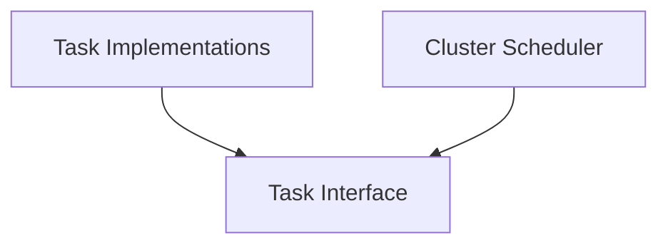

# task_core Module Documentation

## Introduction

The `task_core` module defines the fundamental `Task` interface, establishing a contract for all scheduled and executable operations within the system. It serves as the backbone for various background processes, ensuring a standardized approach to task management.

## Core Functionality

The `task_core` module's primary role is to provide the `Task` interface. This interface outlines the essential methods that any concrete task implementation must adhere to, facilitating consistent scheduling, execution, and state management.

### `Task` Interface (`pkg.task.task.Task`)

```go
type Task interface {
	GetName() string
	GetSchedule() string
	IsEnabled() bool
	Run(ctx context.Context) error
	GetCoreTask() any
}
```

-   `GetName() string`: Returns a unique identifier or name for the task.
-   `GetSchedule() string`: Provides the cron-compatible schedule string for when the task should run.
-   `IsEnabled() bool`: Indicates whether the task is currently active and should be considered for scheduling.
-   `Run(ctx context.Context) error`: Contains the core logic of the task. This method is executed when the task is triggered by the scheduler.
-   `GetCoreTask() any`: Returns the underlying concrete task object. This can be useful for type assertions or introspection in specific scenarios.

## Architecture and Component Relationships

The `task_core` module sits at the base of the task execution framework, defining the blueprint for how tasks are structured. Other modules interact with `task_core` by either implementing its `Task` interface or by consuming `Task` instances for scheduling and execution.

-   **Task Implementations**: Modules like [task_implementations](task_implementations.md) provide concrete implementations of the `Task` interface, encapsulating the specific business logic for each type of background operation.
-   **Cluster Scheduler**: The [cluster_scheduler](cluster_scheduler.md) module is responsible for managing and executing tasks defined by the `Task` interface, typically by polling their schedules and invoking their `Run` methods.

<!-- DIAGRAM_JSON
{
    "direction": "TD",
    "nodes": [
        {"id": "task_interface", "label": "Task Interface", "type": "component", "link": null},
        {"id": "task_implementations", "label": "Task Implementations", "type": "external", "link": "task_implementations.md"},
        {"id": "cluster_scheduler", "label": "Cluster Scheduler", "type": "external", "link": "cluster_scheduler.md"}
    ],
    "edges": [
        {"source": "task_implementations", "target": "task_interface"},
        {"source": "cluster_scheduler", "target": "task_interface"}
    ],
    "groups": []
}
-->

