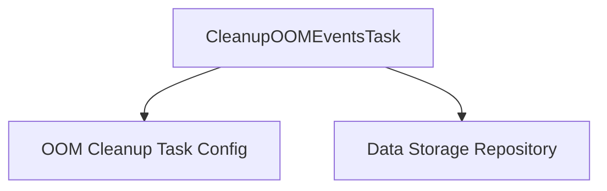

# task_definition Module Documentation

## Introduction

The `task_definition` module is a crucial component within the `cleanup_oom_tasks` submodule, specifically defining the core structure and dependencies for the `CleanupOOMEventsTask`. This task is responsible for orchestrating the cleanup of Out-Of-Memory (OOM) events recorded in the system, ensuring efficient resource management and system stability.

## Architecture and Component Relationships

At its core, the `task_definition` module encapsulates the `CleanupOOMEventsTask`.

### `CleanupOOMEventsTask`

This is the primary component defined in this module. It acts as the blueprint for an OOM event cleanup operation. It holds references to its configuration and the storage mechanism it utilizes:

*   `config`: A pointer to `CleanupOOMEventsTaskConfig`, which holds all the necessary parameters and settings for how the OOM event cleanup should be performed. This configuration is detailed in the [oom_cleanup_task_config.md](oom_cleanup_task_config.md) module documentation.
*   `storage`: A pointer to `storage.Storage`, providing the interface to interact with the underlying data persistence layer. This dependency highlights how the task retrieves and manipulates OOM event data. More information about the storage mechanism can be found in the [data_storage_repository.md](data_storage_repository.md) module documentation.

## How the Module Fits into the Overall System

The `task_definition` module, through `CleanupOOMEventsTask`, plays a vital role in the system's operational hygiene. It is instantiated and managed by the task scheduler (defined in the `cluster_scheduler` module) and executed periodically or on demand. By leveraging the `data_storage_repository` for data access and `oom_cleanup_task_config` for operational parameters, it systematically identifies and processes OOM events, contributing to the overall reliability and performance of the application.

<!-- DIAGRAM_JSON
{
    "direction": "TD",
    "nodes": [
        {"id": "cleanup_oom_events_task", "label": "CleanupOOMEventsTask", "type": "component", "link": null},
        {"id": "oom_cleanup_task_config", "label": "OOM Cleanup Task Config", "type": "external", "link": "oom_cleanup_task_config.md"},
        {"id": "data_storage_repository", "label": "Data Storage Repository", "type": "external", "link": "data_storage_repository.md"}
    ],
    "edges": [
        {"source": "cleanup_oom_events_task", "target": "oom_cleanup_task_config"},
        {"source": "cleanup_oom_events_task", "target": "data_storage_repository"}
    ],
    "groups": []
}
-->
