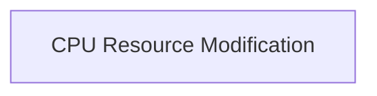

# Task Execution Module

The `task_execution` module is responsible for defining and executing tasks related to modifying CPU resources for containers within a cluster. Specifically, it focuses on tasks that adjust CPU limits for containers based on specific configurations.

## Architecture Overview

The `task_execution` module contains core components that enable the modification of container CPU resources. It leverages Kubernetes clients for interaction with the cluster and a Prometheus client for metrics, as outlined in its primary task definition. The module is composed of a single sub-module:

*   **[CPU Resource Modification](cpu_resource_modification.md)**: Details the task structure and parameters for CPU resource adjustments.

<!-- DIAGRAM_JSON
{
    "direction": "TD",
    "nodes": [
        {"id": "cpu_resource_modification", "label": "CPU Resource Modification", "type": "module", "link": "cpu_resource_modification.md"}
    ],
    "edges": [],
    "groups": []
}
-->

