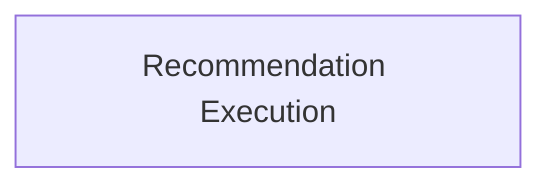

# Task Execution and Results Module

The `task_execution_and_results` module is responsible for the core logic of applying resource recommendations and encapsulating the outcomes of these operations. It defines the structure for tasks that modify resources based on recommendations and the data models to represent the results of such applications, including information about nodes, pods, and any non-optimizable entities.

## Architecture

The module is structured around the execution of recommendation tasks and the handling of their results.

<!-- DIAGRAM_JSON
{
    "direction": "TD",
    "nodes": [
        {"id": "apply_recommendation_execution", "label": "Recommendation Execution", "type": "module", "link": "apply_recommendation_execution.md"}
    ],
    "edges": [],
    "groups": []
}
-->

## Sub-modules

This module contains the following sub-module:

### Recommendation Execution (`apply_recommendation_execution`)
This sub-module defines the `ApplyRecommendationTask` responsible for executing the recommendation logic and the `RecommendationResult` structure to capture the detailed outcome of these operations. It integrates with Kubernetes clients and Prometheus to gather necessary information and apply changes. For more details, refer to the [Recommendation Execution documentation](apply_recommendation_execution.md).
