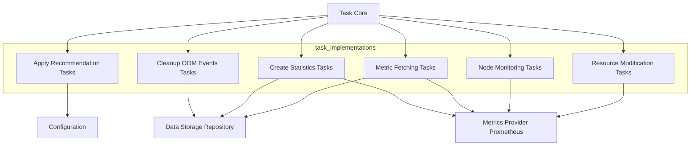

# Task Implementations Module

## Introduction
The `task_implementations` module houses the concrete implementations of various automated tasks executed by the system. These tasks cover a wide range of functionalities, from applying resource recommendations and cleaning up old data to creating statistics and monitoring cluster resources. This module serves as the core engine for operational intelligence and automated resource management within the Kubernetes environment.

## Architecture Overview
The `task_implementations` module is structured into several sub-modules, each responsible for a distinct set of tasks. These tasks often interact with external services like Kubernetes, Prometheus, and internal storage, orchestrating complex operations to maintain cluster health and optimize resource utilization.

<!-- DIAGRAM_JSON
{
    "direction": "TD",
    "nodes": [
        {"id": "apply_recommendation_tasks", "label": "Apply Recommendation Tasks", "type": "module", "link": "apply_recommendation_tasks.md"},
        {"id": "cleanup_oom_tasks", "label": "Cleanup OOM Events Tasks", "type": "module", "link": "cleanup_oom_tasks.md"},
        {"id": "create_stats_tasks", "label": "Create Statistics Tasks", "type": "module", "link": "create_stats_tasks.md"},
        {"id": "metric_fetching_tasks", "label": "Metric Fetching Tasks", "type": "module", "link": "metric_fetching_tasks.md"},
        {"id": "node_monitoring_tasks", "label": "Node Monitoring Tasks", "type": "module", "link": "node_monitoring_tasks.md"},
        {"id": "resource_modification_tasks", "label": "Resource Modification Tasks", "type": "module", "link": "resource_modification_tasks.md"},
        {"id": "task_core", "label": "Task Core", "type": "external", "link": "task_core.md"},
        {"id": "configuration", "label": "Configuration", "type": "external", "link": "configuration.md"},
        {"id": "metrics_provider_prometheus", "label": "Metrics Provider Prometheus", "type": "external", "link": "metrics_provider_prometheus.md"},
        {"id": "data_storage_repository", "label": "Data Storage Repository", "type": "external", "link": "data_storage_repository.md"}
    ],
    "edges": [
        {"source": "task_core", "target": "apply_recommendation_tasks"},
        {"source": "task_core", "target": "cleanup_oom_tasks"},
        {"source": "task_core", "target": "create_stats_tasks"},
        {"source": "task_core", "target": "metric_fetching_tasks"},
        {"source": "task_core", "target": "node_monitoring_tasks"},
        {"source": "task_core", "target": "resource_modification_tasks"},
        {"source": "apply_recommendation_tasks", "target": "configuration"},
        {"source": "cleanup_oom_tasks", "target": "data_storage_repository"},
        {"source": "create_stats_tasks", "target": "metrics_provider_prometheus"},
        {"source": "create_stats_tasks", "target": "data_storage_repository"},
        {"source": "metric_fetching_tasks", "target": "metrics_provider_prometheus"},
        {"source": "metric_fetching_tasks", "target": "data_storage_repository"},
        {"source": "node_monitoring_tasks", "target": "metrics_provider_prometheus"},
        {"source": "resource_modification_tasks", "target": "metrics_provider_prometheus"}
    ],
    "groups": []
}
-->

## Sub-modules Overview

Here's a brief overview of the sub-modules within `task_implementations`:

*   ### [Apply Recommendation Tasks](apply_recommendation_tasks.md)
    This sub-module handles the logic for applying CPU and memory recommendations to containers within Kubernetes pods. It includes components for defining the task configuration, metadata for dry runs and overrides, and the structure for reporting recommendation results.

*   ### [Cleanup OOM Events Tasks](cleanup_oom_tasks.md)
    This sub-module manages the process of periodically cleaning up Out-Of-Memory (OOM) events from the system's storage. It defines the task configuration and metadata for retention policies.

*   ### [Create Statistics Tasks](create_stats_tasks.md)
    This sub-module is responsible for gathering and generating various statistical insights about cluster resource utilization and workload behavior. It includes components for task configuration, metadata for skipping memory statistics, and the core task implementation.

*   ### [Metric Fetching Tasks](metric_fetching_tasks.md)
    This sub-module focuses on fetching and processing metrics data from external metric providers like Prometheus. It defines the task configuration and the task structure for retrieving metrics.

*   ### [Node Monitoring Tasks](node_monitoring_tasks.md)
    This sub-module implements tasks for continuous monitoring of node-level resource usage and load within the cluster. It includes components for task configuration and the core task implementation.

*   ### [Resource Modification Tasks](resource_modification_tasks.md)
    This sub-module contains tasks that modify container resource allocations, particularly focusing on equalizing CPU resources across containers. It includes components for task configuration and the definition of container modifications.
