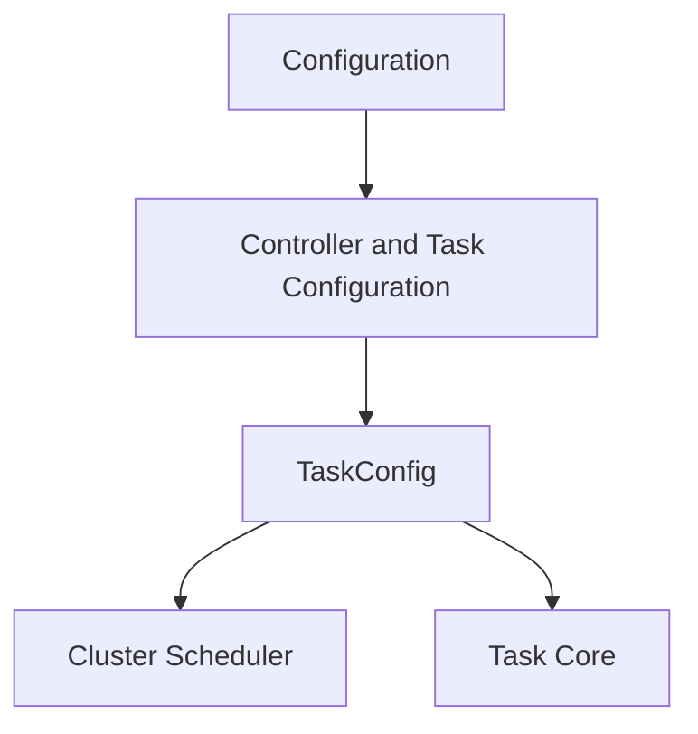

# Module: `task_scheduling`

## Introduction
The `task_scheduling` module is a crucial part of the system's configuration, specifically defining how individual tasks are enabled, scheduled, and configured with metadata. It provides the foundational structure for scheduling within the application, influencing how various operational and maintenance tasks are executed.

## Core Functionality

The `task_scheduling` module is centered around the `TaskConfig` struct, which encapsulates the essential settings for any scheduled task.

### `TaskConfig`
The `TaskConfig` struct (`pkg.config.taskConfig.TaskConfig`) is used to define the properties of a task for scheduling purposes.

```go
type TaskConfig struct {
	Enabled  bool
	Schedule string
	Metadata map[string]interface{}
}
```

*   **`Enabled`**: A boolean flag indicating whether the task is active and should be scheduled.
*   **`Schedule`**: A string representing the schedule for the task, typically in a cron format or similar scheduling expression.
*   **`Metadata`**: A map for storing additional, arbitrary configuration data specific to the task. This allows for flexible and extensible task definitions without modifying the core `TaskConfig` structure.

## Architecture and Component Relationships

The `TaskConfig` component, while simple, plays a pivotal role in orchestrating tasks across the system. It is primarily consumed by scheduling mechanisms to determine when and how tasks are run.

It is a sub-module of `controller_and_task_configuration` within the broader `configuration` module, indicating its role in defining how controllers manage and execute tasks. The actual scheduling logic that interprets and acts upon `TaskConfig` instances resides within the `cluster_scheduler` module. Specific task implementations defined in modules like `task_implementations` would likely retrieve their `TaskConfig` to determine their operational parameters.

<!-- DIAGRAM_JSON
{
    "direction": "TD",
    "nodes": [
        {"id": "task_config", "label": "TaskConfig", "type": "component", "link": null},
        {"id": "controller_and_task_configuration", "label": "Controller and Task Configuration", "type": "external", "link": "controller_and_task_configuration.md"},
        {"id": "configuration", "label": "Configuration", "type": "external", "link": "configuration.md"},
        {"id": "cluster_scheduler", "label": "Cluster Scheduler", "type": "external", "link": "cluster_scheduler.md"},
        {"id": "task_core", "label": "Task Core", "type": "external", "link": "task_core.md"}
    ],
    "edges": [
        {"source": "configuration", "target": "controller_and_task_configuration"},
        {"source": "controller_and_task_configuration", "target": "task_config"},
        {"source": "task_config", "target": "cluster_scheduler"},
        {"source": "task_config", "target": "task_core"}
    ],
    "groups": []
}
-->


## How the Module Fits into the Overall System

The `task_scheduling` module, through its `TaskConfig` definition, is a fundamental building block for the system's automation and operational capabilities. It provides the configurable aspects for all automated tasks, from fetching metrics to applying recommendations or cleaning up events.

It is part of the broader [configuration](configuration.md) system, specifically nested under [controller_and_task_configuration](controller_and_task_configuration.md). This hierarchy ensures that task scheduling parameters are centrally managed and can be easily accessed by various components. The actual execution of tasks based on these configurations is handled by the [cluster_scheduler](cluster_scheduler.md) module, which consumes the `TaskConfig` to manage task lifecycles and trigger their execution according to the defined schedules. This modular design allows for clear separation of concerns, where `task_scheduling` defines *what* and *when* a task should run, while `cluster_scheduler` handles *how* it runs, and modules like [task_implementations](task_implementations.md) define *what the task does*.
