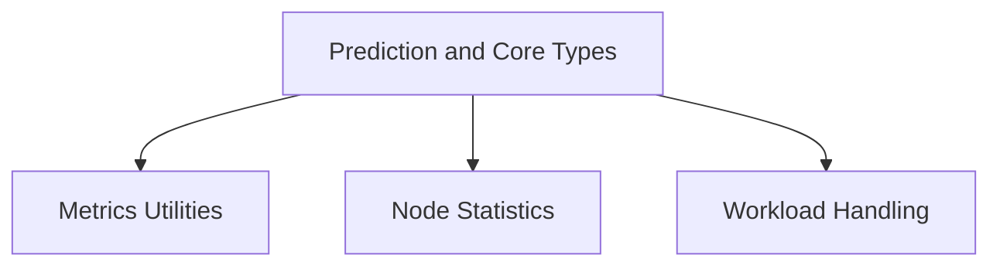

# Task Utilities Module Documentation

## Introduction

The `task_utilities` module provides a collection of utility functions and data structures crucial for various tasks within the system. It encompasses components for handling metrics, node statistics, time series prediction, and Kubernetes workload abstractions. This module serves as a foundational layer, offering essential building blocks for data collection, analysis, and optimization tasks.

## Architecture Overview

The `task_utilities` module is logically divided into several sub-modules, each focusing on a specific area of functionality. These sub-modules work in concert to support the broader task execution and resource optimization efforts within the system.

<!-- DIAGRAM_JSON
{
    "direction": "TD",
    "nodes": [
        {"id": "metrics_utilities", "label": "Metrics Utilities", "type": "module", "link": "metrics_utilities.md"},
        {"id": "node_statistics", "label": "Node Statistics", "type": "module", "link": "node_statistics.md"},
        {"id": "prediction_and_types", "label": "Prediction and Core Types", "type": "module", "link": "prediction_and_types.md"},
        {"id": "workload_handling", "label": "Workload Handling", "type": "module", "link": "workload_handling.md"}
    ],
    "edges": [
        {"source": "prediction_and_types", "target": "metrics_utilities"},
        {"source": "prediction_and_types", "target": "node_statistics"},
        {"source": "prediction_and_types", "target": "workload_handling"}
    ],
    "groups": []
}
-->

## Sub-modules

### [Metrics Utilities](metrics_utilities.md)
Provides data structures for representing container and workload metrics, including CPU, memory, and PSI-adjusted usage.

### [Node Statistics](node_statistics.md)
Defines data structures for gathering and presenting resource information about Kubernetes nodes, pods, and containers.

### [Prediction and Core Types](prediction_and_types.md)
Contains various data types for time series prediction, workload information, node optimization, and container recommendations.

### [Workload Handling](workload_handling.md)
Provides interfaces and wrapper types for interacting with different Kubernetes workload objects like Deployments, StatefulSets, and DaemonSets.

