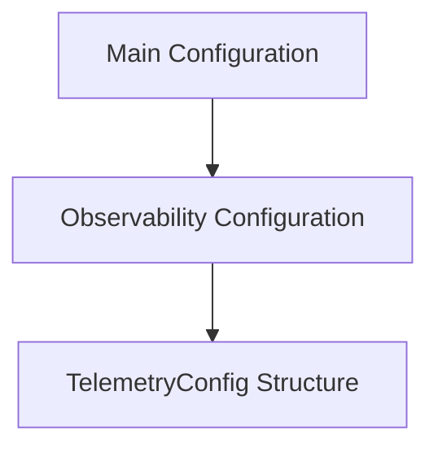

# Telemetry Configuration Module

The `telemetry_configuration` module is a crucial part of the overall system's configuration, specifically focusing on settings related to telemetry data collection and export. It defines the structure for configuring how the application sends its operational data (traces, metrics) to external observability systems.

## Purpose and Core Functionality

This module's primary purpose is to encapsulate all parameters necessary for configuring telemetry aspects of the application. It ensures that various services and components throughout the system can consistently retrieve and apply these settings for observability purposes.

The core component of this module is:

*   **`TelemetryConfig`**: A Go struct that defines the configuration fields for telemetry, including:
    *   `Enabled`: A boolean indicating whether telemetry is active.
    *   `ExporterOTLPEndpoint`: The endpoint URL for the OTLP (OpenTelemetry Protocol) exporter.
    *   `ExporterOTLPHeaders`: Custom headers to be sent with OTLP exports.
    *   `ServiceName`: The name of the service sending telemetry data.
    *   `TraceRatio`: A float64 value representing the sampling ratio for traces.

## Architecture and Component Relationships

The `telemetry_configuration` module, through its `TelemetryConfig` structure, is a sub-component of the wider [observability_configuration module](observability_configuration.md). The `observability_configuration` module, in turn, is part of the main [configuration module](configuration.md), which aggregates all system configurations.

This hierarchical structure allows for a clear separation of concerns, where `TelemetryConfig` specifically manages telemetry settings, while `observability_configuration` groups all observability-related settings (including metrics), and `configuration` acts as the root for all application settings.

<!-- DIAGRAM_JSON
{
    "direction": "TD",
    "nodes": [
        {"id": "telemetry_config", "label": "TelemetryConfig Structure", "type": "component", "link": null},
        {"id": "observability_configuration", "label": "Observability Configuration", "type": "external", "link": "observability_configuration.md"},
        {"id": "configuration", "label": "Main Configuration", "type": "external", "link": "configuration.md"}
    ],
    "edges": [
        {"source": "observability_configuration", "target": "telemetry_config"},
        {"source": "configuration", "target": "observability_configuration"}
    ],
    "groups": []
}
-->

## How the Module Fits into the Overall System

The `telemetry_configuration` module provides essential runtime settings for any part of the system responsible for emitting traces or metrics. Modules requiring telemetry configuration, such as a tracing client or a metrics exporter, would typically retrieve the `TelemetryConfig` instance from the broader [configuration module](configuration.md) to initialize their behavior. This ensures that all telemetry-related operations across the application adhere to a centralized and consistent set of parameters.
