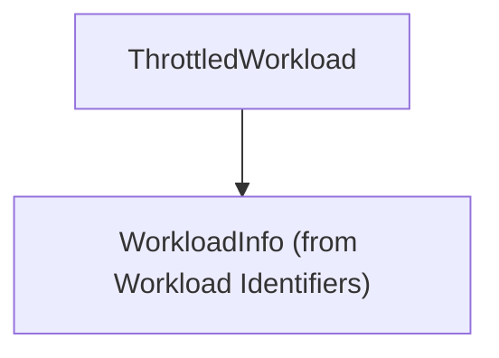

# Throttled Workload Monitoring

The `throttled_workload_monitoring` module provides a data structure for representing workloads that are experiencing CPU throttling. This information is crucial for identifying performance bottlenecks and guiding resource optimization efforts within a Kubernetes cluster.

## Core Functionality

This module defines the `ThrottledWorkload` structure, which encapsulates key details about a throttled container within a specific workload.

### `ThrottledWorkload`

```go
type ThrottledWorkload struct {
	WorkloadInfo    WorkloadInfo
	ThrottlingRatio float64
	ContainerName   string
}
```

- **`WorkloadInfo`**: (Type: [WorkloadInfo](workload_and_container_identifiers.md)) Provides identifying information about the workload to which the throttled container belongs. This includes details like the workload's kind, namespace, and name.
- **`ThrottlingRatio`**: (Type: `float64`) Represents the ratio of CPU throttling experienced by the container. A higher value indicates more significant throttling.
- **`ContainerName`**: (Type: `string`) The name of the specific container within the workload that is being throttled.

## Architecture and Component Relationships

The `ThrottledWorkload` type is a fundamental data model within the `optimization_and_metrics` sub-module of `task_utilities`. It primarily relies on the `WorkloadInfo` structure, defined in the [workload_and_container_identifiers module](workload_and_container_identifiers.md), to identify the associated workload.

This module plays a role in various resource management tasks, where identifying and tracking throttled workloads is essential for making informed decisions about scaling or reconfiguring resources.

<!-- DIAGRAM_JSON
{
    "direction": "TD",
    "nodes": [
        {"id": "throttled_workload", "label": "ThrottledWorkload", "type": "component", "link": null},
        {"id": "workload_info", "label": "WorkloadInfo (from Workload Identifiers)", "type": "external", "link": "workload_and_container_identifiers.md"}
    ],
    "edges": [
        {"source": "throttled_workload", "target": "workload_info"}
    ],
    "groups": []
}
-->
