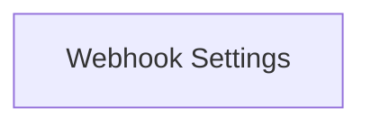

# Webhook Configuration Module

The `webhook_configuration` module is responsible for defining the structure and settings required to configure the webhook server and its associated URL endpoints within the system.

## Architecture Overview

This module primarily consists of configuration structures that dictate how the webhook server operates, including its network settings, security configurations (like certificate directories), and external communication URLs. It relies on the core `configuration` module for its overall structure.

<!-- DIAGRAM_JSON
{
    "direction": "TD",
    "nodes": [
        {"id": "webhook_settings", "label": "Webhook Settings", "type": "module", "link": "webhook_settings.md"}
    ],
    "edges": [],
    "groups": []
}
-->

## Sub-modules

### [Webhook Settings](webhook_settings.md)
This sub-module encapsulates the crucial configurations for the webhook server, detailing its operational parameters such as the listening port, the directory for SSL certificates, and whether it operates in a dry-run mode. It also includes definitions for external URLs, specifically for stats reporting, ensuring the webhook can communicate effectively with other services.