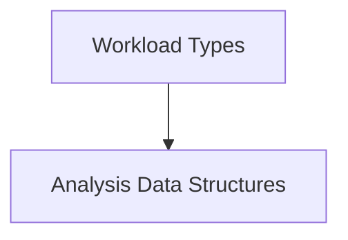

# Workload Analysis Module

The `workload_analysis` module, nested within `data_types` and `workload_types`, defines the core data structures used for analyzing and reporting on workload performance and optimization recommendations. It serves as the foundational data model for various components that process, store, and display information related to Kubernetes workload efficiency and potential improvements.

## Architecture Overview

This module primarily focuses on providing the structured data types that represent different aspects of workload analysis and recommendations. It is a critical dependency for services that generate, consume, or present workload insights, such as monitoring tools, recommendation engines, and API interfaces. The structures defined here are utilized across the system to ensure consistent data representation.

<!-- DIAGRAM_JSON
{
    "direction": "TD",
    "nodes": [
        {"id": "analysis_data_structures", "label": "Analysis Data Structures", "type": "module", "link": "analysis_data_structures.md"},
        {"id": "workload_types", "label": "Workload Types", "type": "external", "link": "workload_types.md"}
    ],
    "edges": [
        {"source": "workload_types", "target": "analysis_data_structures"}
    ],
    "groups": []
}
-->

## Sub-modules

### [Analysis Data Structures](analysis_data_structures.md)
This sub-module defines the fundamental data structures, `WorkloadAnalysisItem` and `RecommendationAnalysisItem`, which are used to encapsulate detailed information about workload performance, resource utilization, and potential optimization recommendations. These structures are crucial for standardizing data exchange and processing across the workload analysis system.