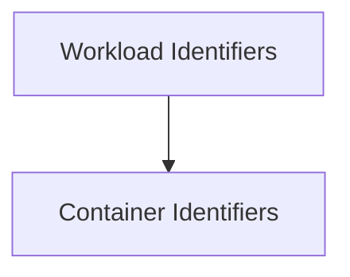

# Workload and Container Identifiers

## Introduction
The `workload_and_container_identifiers` module provides fundamental data structures for uniquely identifying and referencing workloads, pods, and containers within a Kubernetes environment. These identifiers are crucial for various operations, including monitoring, scheduling, and applying recommendations across the system.

## Architecture Overview
This module is part of the `prediction_and_types` utilities, which itself is a sub-module of `task_utilities`. It defines the core types used throughout the application to precisely pinpoint and manage Kubernetes resources.

<!-- DIAGRAM_JSON
{
    "direction": "TD",
    "nodes": [
        {"id": "workload_identifiers", "label": "Workload Identifiers", "type": "module", "link": "workload_identifiers.md"},
        {"id": "container_identifiers", "label": "Container Identifiers", "type": "module", "link": "container_identifiers.md"}
    ],
    "edges": [
        {"source": "workload_identifiers", "target": "container_identifiers"}
    ],
    "groups": []
}
-->

## Sub-modules

### Workload Identifiers ([workload_identifiers.md](workload_identifiers.md))
This sub-module defines structures for uniquely identifying workloads within the system. It includes `WorkloadInfo` for basic workload identification and `WorkloadLabelSelectorList` for workloads that also require label-based selection.

### Container Identifiers ([container_identifiers.md](container_identifiers.md))
This sub-module provides data structures for identifying individual pods and containers. It includes `PodKey` for identifying pods, `ContainerKey` for identifying containers within a pod, and `WorkloadContainerKey` for identifying containers that belong to a specific workload.

