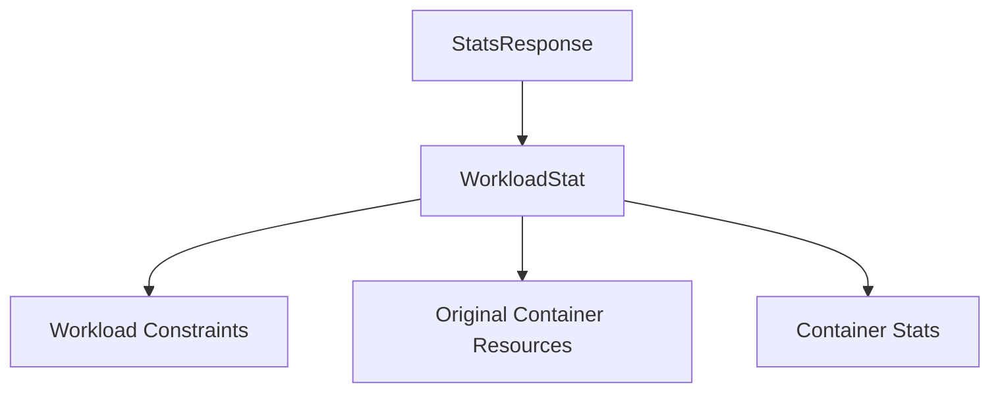

# workload_data_structures

The `workload_data_structures` module defines the fundamental data structures used to represent statistical information and metadata related to workloads within the system. These structures are crucial for collecting, storing, and exposing workload-specific metrics and configuration details, enabling monitoring, analysis, and optimization processes.

## Core Functionality

This module primarily provides two key data structures:

*   **`StatsResponse`**: Serves as the top-level response object for statistical queries, encapsulating a collection of `WorkloadStat` entries.
    ```go
type StatsResponse struct {
	Stats []WorkloadStat `json:"stats"`
}
    ```

*   **`WorkloadStat`**: Provides a comprehensive snapshot of a single workload, including its identification, operational parameters, and aggregated statistical data from its containers.
    ```go
type WorkloadStat struct {
	WorkloadIdentifier            string               `json:"workload"`
	Kind                          string               `json:"kind"`
	Namespace                     string               `json:"namespace"`
	Name                          string               `json:"name"`
	CreationTime                  time.Time            `json:"creation_time"`
	UpdatedAt                     time.Time            `json:"updated_at"`
	ContinuousOptimization        bool                 `json:"continuous_optimization"`
	IsHorizontallyAutoscaledOnCPU bool                 `json:"is_horizontally_autoscaled_on_cpu"`
	Constraints                   *WorkloadConstraints `json:"constraints,omitempty"`
	EvictionRanking               EvictionRanking      `json:"eviction_ranking"`
	Replicas                      int32                `json:"replicas"`

	ContainerStats             []ContainerStats             `json:"container_stats"`
	OriginalContainerResources []OriginalContainerResources `json:"original_container_resources"`
}
    ```

## Architecture and Component Relationships

The `workload_data_structures` module acts as a central point for defining how workload statistics are structured. It integrates with other modules that provide more granular details for specific aspects of a workload's statistics.

*   `StatsResponse` aggregates `WorkloadStat` objects.
*   `WorkloadStat` depends on `WorkloadConstraints` (defined in [workload_control_parameters.md](workload_control_parameters.md)), `OriginalContainerResources` (defined in [container_resource_definitions.md](container_resource_definitions.md)), and `ContainerStats` (defined in [container_metrics.md](container_metrics.md)) for its detailed properties.

## How the module fits into the overall system

This module is a foundational part of the system's data typing layer, specifically for statistical reporting. It ensures consistency in how workload statistics are transmitted and processed across different components. Other modules, such as those responsible for data collection, aggregation, and API responses, will utilize these structures to interact with workload statistical data. For instance, the `data_storage_repository` might store data conforming to these structures, and `api_handlers` would use `StatsResponse` to return workload statistics.

<!-- DIAGRAM_JSON
{
    "direction": "TD",
    "nodes": [
        {"id": "stats_response", "label": "StatsResponse", "type": "component", "link": null},
        {"id": "workload_stat", "label": "WorkloadStat", "type": "component", "link": null},
        {"id": "workload_control_parameters", "label": "Workload Constraints", "type": "external", "link": "workload_control_parameters.md"},
        {"id": "container_resource_definitions", "label": "Original Container Resources", "type": "external", "link": "container_resource_definitions.md"},
        {"id": "container_metrics", "label": "Container Stats", "type": "external", "link": "container_metrics.md"}
    ],
    "edges": [
        {"source": "stats_response", "target": "workload_stat"},
        {"source": "workload_stat", "target": "workload_control_parameters"},
        {"source": "workload_stat", "target": "container_resource_definitions"},
        {"source": "workload_stat", "target": "container_metrics"}
    ],
    "groups": []
}
-->

