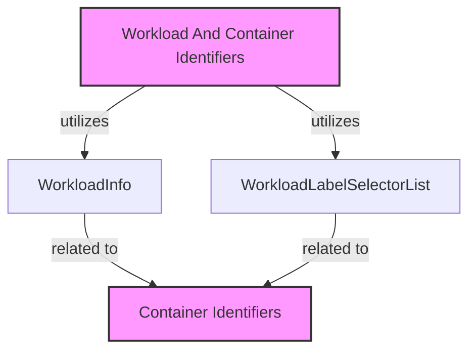

# workload_identifiers

The `workload_identifiers` module provides fundamental data structures for identifying and referencing Kubernetes workloads within the system. It defines basic workload information and structures for identifying workloads using label selectors. These identifiers are crucial for various tasks across the application that need to target, filter, or manage specific Kubernetes resources.

## Architecture and Component Relationships

This module is a leaf module within the `task_utilities` component hierarchy, specifically residing under `task_utilities` -> `prediction_and_types` -> `workload_and_container_identifiers`. It serves as a foundational element, providing basic types that other modules, particularly its parent and sibling (`container_identifiers`), can utilize to define more complex identification or data processing logic.

The core components defined in this module are:
*   `WorkloadInfo`: Provides basic identification details for a Kubernetes workload.
*   `WorkloadLabelSelectorList`: Extends `WorkloadInfo` with a Kubernetes label selector, enabling more flexible workload targeting.

These components are frequently used by tasks that require interaction with specific Kubernetes deployments, stateful sets, or daemon sets, allowing for precise targeting and filtering of resources.

<!-- DIAGRAM_JSON
{
    "direction": "TD",
    "nodes": [
        {"id": "workload_info", "label": "WorkloadInfo", "type": "component", "link": null},
        {"id": "workload_label_selector_list", "label": "WorkloadLabelSelectorList", "type": "component", "link": null},
        {"id": "workload_and_container_identifiers", "label": "Workload And Container Identifiers", "type": "external", "link": "workload_and_container_identifiers.md"},
        {"id": "container_identifiers", "label": "Container Identifiers", "type": "external", "link": "container_identifiers.md"}
    ],
    "edges": [
        {"source": "workload_and_container_identifiers", "target": "workload_info", "label": "utilizes"},
        {"source": "workload_and_container_identifiers", "target": "workload_label_selector_list", "label": "utilizes"},
        {"source": "workload_info", "target": "container_identifiers", "label": "related to"},
        {"source": "workload_label_selector_list", "target": "container_identifiers", "label": "related to"}
    ],
    "groups": []
}
-->


## Core Components

### `WorkloadInfo`

```go
type WorkloadInfo struct {
	Kind      string
	Namespace string
	Name      string
}
```
`WorkloadInfo` provides a basic structure for identifying a Kubernetes workload by its `Kind` (e.g., "Deployment", "StatefulSet"), `Namespace`, and `Name`. This is the most common way to uniquely refer to a specific workload within a cluster.

### `WorkloadLabelSelectorList`

```go
type WorkloadLabelSelectorList struct {
	Kind      string
	Namespace string
	Name      string
	Selector  labels.Selector
}
```
`WorkloadLabelSelectorList` extends `WorkloadInfo` by adding a `Selector` field. This allows for identifying a workload not just by its explicit name but also by a Kubernetes label selector. This is particularly useful for operations that need to apply to a group of pods or resources that match certain labels, offering more flexibility in targeting.

## How it Fits into the Overall System

The `workload_identifiers` module, through its `WorkloadInfo` and `WorkloadLabelSelectorList` types, forms a critical part of how the system interacts with and manages Kubernetes resources. These types are fundamental for:

*   **Task Execution**: Many tasks, especially those in the `task_implementations` module, require precise identification of target workloads to fetch metrics, apply recommendations, or perform other cluster operations.
*   **Data Aggregation and Analysis**: Modules like `metrics_utilities` and `prediction_and_types` rely on these identifiers to aggregate data or generate predictions for specific workloads.
*   **API Interactions**: When interacting with the Kubernetes API or other internal services, these identifier structures ensure that operations are directed at the correct resources.

It provides the basic language for referencing Kubernetes workloads, enabling higher-level modules to build sophisticated logic upon a consistent and robust identification mechanism.
