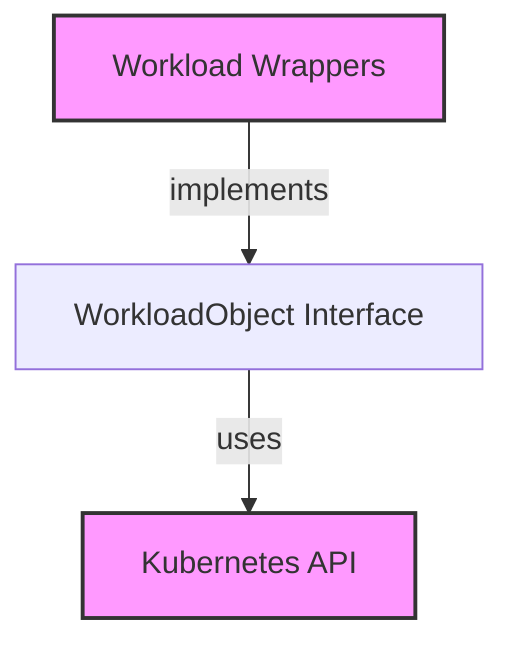

# `workload_interface` Module Documentation

The `workload_interface` module defines a crucial abstraction for interacting with Kubernetes workloads within the system. It provides a standardized interface, `WorkloadObject`, that allows other components to manage different types of Kubernetes resources (e.g., Deployments, StatefulSets, DaemonSets) through a unified API, without needing to know their specific underlying implementations. This promotes loose coupling and simplifies workload-agnostic operations across the application.

### Core Functionality and Architecture

The core of this module is the `WorkloadObject` interface, which specifies a set of methods for retrieving common information and manipulating Kubernetes workloads. This interface acts as a contract that concrete workload wrappers (such as `DeploymentWrapper`, `StatefulSetWrapper`, and `DaemonSetWrapper` found in the [workload_wrappers](workload_wrappers.md) module) must implement.

**`WorkloadObject` Interface:**

```go
type WorkloadObject interface {
	GetNamespace() string
	GetName() string
	GetContainerSpecs(ctx context.Context, kubeClient *kubernetes.Clientset) []corev1.Container
	GetInitContainerSpecs(ctx context.Context, kubeClient *kubernetes.Clientset) []corev1.Container
	GetSelector() (labels.Selector, error)
	GetCreationTime() time.Time
}
```

*   **`GetNamespace()`**: Returns the Kubernetes namespace of the workload.
*   **`GetName()`**: Returns the name of the workload.
*   **`GetContainerSpecs(ctx context.Context, kubeClient *kubernetes.Clientset)`**: Retrieves the specifications of the regular containers within the workload. It requires a Kubernetes client to fetch the necessary information.
*   **`GetInitContainerSpecs(ctx context.Context, kubeClient *kubernetes.Clientset)`**: Retrieves the specifications of the init containers within the workload, also requiring a Kubernetes client.
*   **`GetSelector()`**: Returns the label selector associated with the workload, used for identifying pods belonging to it.
*   **`GetCreationTime()`**: Returns the timestamp when the workload was created.

The `WorkloadObject` interface relies on the Kubernetes API for its operations, specifically using `kubernetes.Clientset` for client interactions and `corev1.Container` and `labels.Selector` for data types.

<!-- DIAGRAM_JSON
{
    "direction": "TD",
    "nodes": [
        {"id": "workload_object", "label": "WorkloadObject Interface", "type": "component", "link": null},
        {"id": "workload_wrappers", "label": "Workload Wrappers", "type": "external", "link": "workload_wrappers.md"},
        {"id": "kubernetes_api", "label": "Kubernetes API", "type": "external", "link": null}
    ],
    "edges": [
        {"source": "workload_wrappers", "target": "workload_object", "label": "implements"},
        {"source": "workload_object", "target": "kubernetes_api", "label": "uses"}
    ],
    "groups": []
}
-->


### Integration with the Overall System

The `workload_interface` module, specifically the `WorkloadObject` interface, is a fundamental building block for any component that needs to interact with Kubernetes workloads generically.

Modules like [task_utilities](task_utilities.md) and its sub-modules, which often deal with fetching metrics, applying recommendations, or performing other operations across different workload types, leverage this interface. By depending on `WorkloadObject`, these modules can process Deployments, StatefulSets, and DaemonSets uniformly, without needing to implement separate logic for each. This design significantly reduces code duplication and improves maintainability across the system, particularly within the [task_implementations](task_implementations.md) where specific tasks might involve modifying or analyzing various workloads.