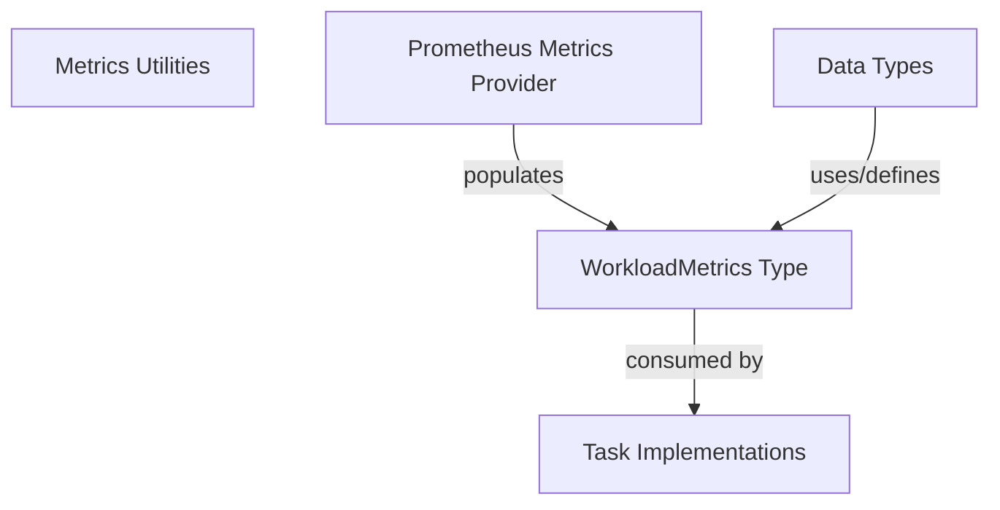

# Workload Metrics Summary Module

The `workload_metrics_summary` module is a focused component within the larger `metrics_utilities` module, primarily responsible for defining the `WorkloadMetrics` data structure. This structure encapsulates key summary metrics pertaining to a workload, specifically the median number of replicas.

## Purpose and Core Functionality

The primary purpose of this module is to provide a standardized data type for summarizing high-level workload metrics. It currently contains a single core component:

*   **`WorkloadMetrics` (`pkg.task.utils.metrics.WorkloadMetrics`)**: This Go struct serves as a container for aggregated metrics about a specific workload. Its current definition includes `MedianReplicas`, indicating the median number of replicas observed for a given workload over a period. This simple yet crucial metric helps in understanding the typical scaling behavior and stability of a deployed workload.

## Architecture and Component Relationships

The `workload_metrics_summary` module is a leaf module, containing only the `WorkloadMetrics` data structure. It is nested within the `metrics_utilities` module, which in turn is part of `task_utilities`.

*   **Parent Module**: [metrics_utilities](metrics_utilities.md) - This module groups various utilities related to metrics processing and data structures, providing a broader context for `WorkloadMetrics`.
*   **Data Source**: [metrics_provider_prometheus](metrics_provider_prometheus.md) - Components within the Prometheus metrics provider are likely responsible for querying and processing raw metric data to calculate and populate instances of `WorkloadMetrics`.
*   **Consumers**: [task_implementations](task_implementations.md) - Various task implementations (e.g., those performing analysis, recommendations, or resource adjustments) would consume `WorkloadMetrics` to make informed decisions about workload management.
*   **Related Data Types**: [data_types](data_types.md) - Other modules defining broader data types might embed or reference `WorkloadMetrics` as part of more comprehensive workload descriptions or statistical reports.

## How the Module Fits into the Overall System

`workload_metrics_summary` plays a foundational role by defining a critical data structure used throughout the system for workload analysis. It acts as an abstraction layer for a specific workload metric, ensuring consistency in how this information is handled.

When a task needs to understand the historical scaling of a workload, it can rely on an instance of `WorkloadMetrics` populated by a metrics collection mechanism (like the Prometheus provider). This enables tasks in `task_implementations` to evaluate workload stability, identify scaling patterns, and inform resource optimization strategies.

<!-- DIAGRAM_JSON
{
    "direction": "TD",
    "nodes": [
        {"id": "workload_metrics_summary_type", "label": "WorkloadMetrics Type", "type": "component", "link": null},
        {"id": "metrics_utilities", "label": "Metrics Utilities", "type": "external", "link": "metrics_utilities.md"},
        {"id": "metrics_provider_prometheus", "label": "Prometheus Metrics Provider", "type": "external", "link": "metrics_provider_prometheus.md"},
        {"id": "task_implementations", "label": "Task Implementations", "type": "external", "link": "task_implementations.md"},
        {"id": "data_types", "label": "Data Types", "type": "external", "link": "data_types.md"}
    ],
    "edges": [
        {"source": "metrics_provider_prometheus", "target": "workload_metrics_summary_type", "label": "populates"},
        {"source": "workload_metrics_summary_type", "target": "task_implementations", "label": "consumed by"},
        {"source": "data_types", "target": "workload_metrics_summary_type", "label": "uses/defines"}
    ],
    "groups": []
}
-->
