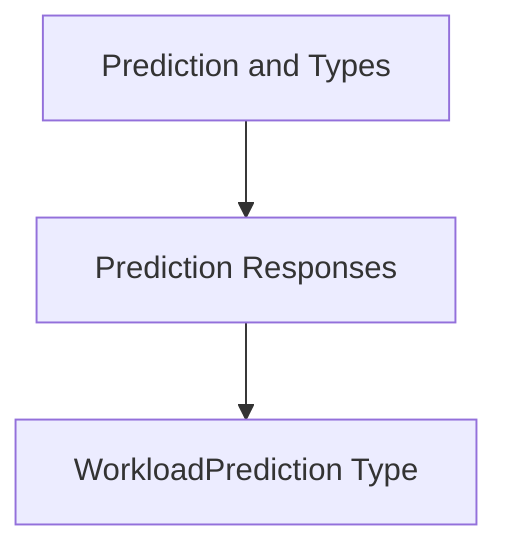

# Module: `workload_prediction_types`

## Introduction
The `workload_prediction_types` module defines the fundamental data structures used to represent workload predictions within the system. Its primary role is to provide a clear and consistent format for statistical predictions, enabling other modules to easily interpret and utilize workload forecasting data.

## Core Functionality

This module contains the `WorkloadPrediction` struct, which encapsulates various percentiles of a predicted workload. This structure is crucial for communicating statistical insights about expected resource usage (e.g., CPU, memory) for workloads.

### `WorkloadPrediction`
`pkg.task.utils.types.WorkloadPrediction`

```go
type WorkloadPrediction struct {
	Median float64
	P90    float64
	P95    float64
	P99    float64
}
```

The `WorkloadPrediction` struct provides the following fields:
*   **`Median`**: Represents the 50th percentile (median) of the predicted workload.
*   **`P90`**: Represents the 90th percentile of the predicted workload, indicating a value that the workload is expected to be below 90% of the time.
*   **`P95`**: Represents the 95th percentile of the predicted workload, indicating a value that the workload is expected to be below 95% of the time.
*   **`P99`**: Represents the 99th percentile of the predicted workload, indicating a value that the workload is expected to be below 99% of the time.

These percentile values are vital for making informed decisions about resource allocation and scaling, allowing for a balance between efficiency and reliability.

## Architecture and Component Relationships

The `workload_prediction_types` module is a leaf module focusing solely on the definition of the `WorkloadPrediction` data structure. It resides within the larger [prediction_and_types.md](prediction_and_types.md) module, specifically as part of the [prediction_responses.md](prediction_responses.md) sub-module. This placement highlights its role in defining the format of prediction results returned by forecasting components.

Other modules that generate or consume workload prediction data will utilize this type to ensure data consistency and interoperability.

<!-- DIAGRAM_JSON
{
    "direction": "TD",
    "nodes": [
        {"id": "workload_prediction", "label": "WorkloadPrediction Type", "type": "component", "link": null},
        {"id": "prediction_responses", "label": "Prediction Responses", "type": "external", "link": "prediction_responses.md"},
        {"id": "prediction_and_types", "label": "Prediction and Types", "type": "external", "link": "prediction_and_types.md"}
    ],
    "edges": [
        {"source": "prediction_responses", "target": "workload_prediction"},
        {"source": "prediction_and_types", "target": "prediction_responses"}
    ],
    "groups": []
}
-->


## Integration with Overall System

The `WorkloadPrediction` type serves as a standard output format for any component responsible for forecasting workload resource requirements. This allows various parts of the system, such as resource recommenders, autoscalers, or monitoring dashboards, to consume and act upon consistent prediction data without needing to understand the internal mechanics of the prediction generation.

By defining a clear contract for workload predictions, this module contributes to the modularity and maintainability of the entire system, particularly within the task processing and utility layers.
