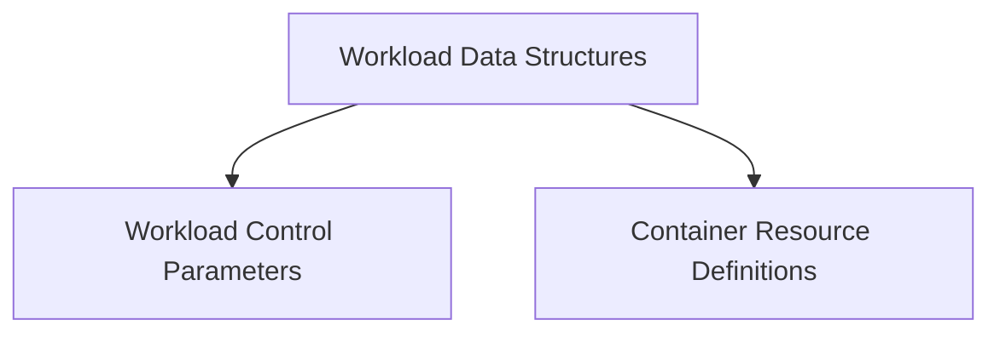

# Workload Statistics Module

## Introduction

The `workload_statistics` module defines the core data structures used to represent and report statistical information about workloads within the system. It provides a standardized format for capturing workload health, performance, constraints, and resource utilization, which is crucial for monitoring, analysis, and optimization tasks.

This module is a child of the [stats_types module](stats_types.md) and focuses specifically on the high-level workload statistical responses, constraints, and original resource configurations.

## Architecture Overview

The `workload_statistics` module is structured into several sub-modules, each handling a specific aspect of workload data representation:

*   **Workload Data Structures:** Defines the primary response and individual workload statistic records.
*   **Workload Control Parameters:** Manages workload-specific constraints and override settings.
*   **Container Resource Definitions:** Specifies the original resource requests and limits for containers.

These sub-modules work together to provide a comprehensive view of workload statistics, enabling other parts of the system (such as the [metrics provider prometheus module](metrics_provider_prometheus.md) and [task implementations module](task_implementations.md)) to consume and process this data effectively.

<!-- DIAGRAM_JSON
{
    "direction": "TD",
    "nodes": [
        {"id": "workload_data_structures", "label": "Workload Data Structures", "type": "module", "link": "workload_data_structures.md"},
        {"id": "workload_control_parameters", "label": "Workload Control Parameters", "type": "module", "link": "workload_control_parameters.md"},
        {"id": "container_resource_definitions", "label": "Container Resource Definitions", "type": "module", "link": "container_resource_definitions.md"}
    ],
    "edges": [
        {"source": "workload_data_structures", "target": "workload_control_parameters"},
        {"source": "workload_data_structures", "target": "container_resource_definitions"}
    ],
    "groups": []
}
-->

## Sub-modules

*   ### [Workload Data Structures](workload_data_structures.md)
    This sub-module defines the `StatsResponse` and `WorkloadStat` types, which are fundamental for aggregating and presenting workload-specific statistics. `StatsResponse` acts as the wrapper for a collection of `WorkloadStat` objects, each detailing a single workload.

*   ### [Workload Control Parameters](workload_control_parameters.md)
    This sub-module includes `WorkloadConstraints` and `Overrides`. `WorkloadConstraints` enumerates various conditions that might prevent or affect workload optimization, such as PDBs, volume attachments, or anti-affinity rules. `Overrides` allows for specific adjustments to be applied, like eviction ranking.

*   ### [Container Resource Definitions](container_resource_definitions.md)
    This sub-module focuses on `OriginalContainerResources`, providing a clear record of the initial CPU and memory requests and limits set for containers within a workload. This information is critical for understanding the baseline resource allocation before any optimizations or changes.

## Relationships to Other Modules

*   **[Stats Types](stats_types.md):** As a direct child, this module builds upon the foundational types defined in `stats_types`, extending them to provide specific workload-level statistical data.
*   **[Container Metrics](container_metrics.md):** The `WorkloadStat` component within this module references `ContainerStats`, which are detailed in the `container_metrics` module. This shows how workload statistics are composed of individual container-level metrics.
*   **[Metrics Provider Prometheus](metrics_provider_prometheus.md):** Data defined in this module, particularly `WorkloadStat` and `ContainerStats`, would be collected and aggregated by a metrics provider like Prometheus.
*   **[Task Implementations](task_implementations.md):** Tasks such as `CreateStatsTask` within `task_implementations` would generate and populate the data structures defined in `workload_statistics` for further processing and analysis.
