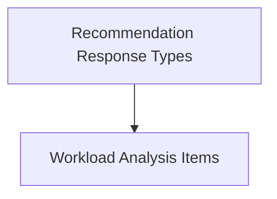

# Workload Types Module

This module (`workload_types`) defines the core data structures used throughout the system for representing workload analysis, recommendations, and related operational responses. It serves as a foundational layer for exchanging structured information about Kubernetes workloads, their resource usage, and optimization suggestions.

## Architecture Overview

The `workload_types` module is a crucial part of the overall data typing system, providing the necessary structures for communication between different services, such as the recommender client, API handlers, and task implementations. It primarily focuses on the definitions related to workload-specific data rather than operational statistics, which are handled by the [stats_types module](stats_types.md).

<!-- DIAGRAM_JSON
{
    "direction": "TD",
    "nodes": [
        {"id": "workload_analysis", "label": "Workload Analysis Items", "type": "module", "link": "workload_analysis.md"},
        {"id": "recommendation_responses", "label": "Recommendation Response Types", "type": "module", "link": "recommendation_responses.md"}
    ],
    "edges": [
        {"source": "recommendation_responses", "target": "workload_analysis"}
    ],
    "groups": []
}
-->

## Sub-modules

### [Recommendation Response Types](recommendation_responses.md)
This sub-module defines data structures for various recommendation responses, including comprehensive analysis responses, summary statistics of recommendations, details on killswitch operations, and information for overriding workload behaviors.

### [Workload Analysis Items](workload_analysis.md)
This sub-module provides the data structures for detailed workload analysis. It includes definitions for individual workload analysis items and more comprehensive recommendation analysis items that incorporate specific pod and node information along with current and recommended resource values.