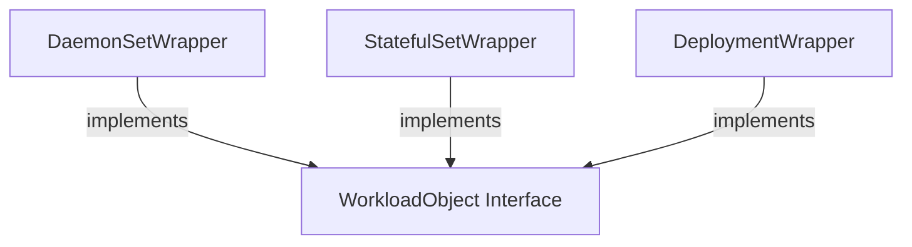

The `workload_wrappers` module provides concrete implementations for handling various Kubernetes workload types, specifically DaemonSets, StatefulSets, and Deployments. It acts as an abstraction layer, offering consistent wrapper structures that embed the native Kubernetes API objects. This allows other modules within the system to interact with these different workload kinds through a standardized interface, simplifying workload management and manipulation.

### Purpose and Core Functionality

The primary purpose of the `workload_wrappers` module is to encapsulate Kubernetes workload objects, such as `appsv1.DaemonSet`, `appsv1.StatefulSet`, and `appsv1.Deployment`. By wrapping these native Kubernetes types, the module aims to:

1.  **Standardize Access**: Provide a uniform way to access and modify properties of different Kubernetes workloads.
2.  **Facilitate Extension**: Allow for the addition of common methods or logic applicable across various workload types, potentially by implementing a shared interface (like `WorkloadObject` from the `workload_interface` module).
3.  **Improve Readability**: Abstract away direct Kubernetes API object manipulation, leading to cleaner and more maintainable code in modules that interact with these workloads.

The core components of this module are:

*   **`DaemonSetWrapper`**: A struct that embeds an `appsv1.DaemonSet` object.
*   **`StatefulSetWrapper`**: A struct that embeds an `appsv1.StatefulSet` object.
*   **`DeploymentWrapper`**: A struct that embeds an `appsv1.Deployment` object.

Each wrapper effectively "is a" corresponding Kubernetes workload object, inheriting its fields and methods, while also being able to implement custom behavior.

### Architecture and Component Relationships

The `workload_wrappers` module is a leaf module within the `task_utilities` subsystem, specifically under `task_utilities -> workload_handling -> kubernetes_workload_wrappers`. Its components (`DaemonSetWrapper`, `StatefulSetWrapper`, `DeploymentWrapper`) are designed to work in conjunction with the `WorkloadObject` interface defined in the sibling `workload_interface` module. While the provided code only shows the struct definitions, these wrappers are intended to implement the `WorkloadObject` interface, thereby conforming to a common contract for workload interaction.

The relationships are as follows:

*   The `DaemonSetWrapper` wraps an `appsv1.DaemonSet`.
*   The `StatefulSetWrapper` wraps an `appsv1.StatefulSet`.
*   The `DeploymentWrapper` wraps an `appsv1.Deployment`.
*   All wrappers implicitly or explicitly implement the `WorkloadObject` interface, defining a common set of operations for Kubernetes workloads.

<!-- DIAGRAM_JSON
{
    "direction": "TD",
    "nodes": [
        {"id": "daemonset_wrapper", "label": "DaemonSetWrapper", "type": "component", "link": null},
        {"id": "statefulset_wrapper", "label": "StatefulSetWrapper", "type": "component", "link": null},
        {"id": "deployment_wrapper", "label": "DeploymentWrapper", "type": "component", "link": null},
        {"id": "workload_object", "label": "WorkloadObject Interface", "type": "external", "link": "workload_interface.md"}
    ],
    "edges": [
        {"source": "daemonset_wrapper", "target": "workload_object", "label": "implements"},
        {"source": "statefulset_wrapper", "target": "workload_object", "label": "implements"},
        {"source": "deployment_wrapper", "target": "workload_object", "label": "implements"}
    ],
    "groups": []
}
-->

### Integration with the Overall System

The `workload_wrappers` module plays a crucial role in the system by providing the foundational structures for interacting with Kubernetes workloads. It is a key dependency for higher-level modules, particularly those within `task_implementations` that need to perform operations like applying recommendations, fetching metrics, or modifying resources on different types of Kubernetes deployments.

For instance, tasks like `task_implementations.ApplyRecommendationTask` or `task_implementations.ModifyEqualCPUResourcesTask` would likely utilize these wrappers to get and set resource requests/limits, labels, or other properties on DaemonSets, StatefulSets, or Deployments without needing to differentiate between the underlying Kubernetes API types directly. This abstraction contributes significantly to the system's flexibility and extensibility when managing cloud-native applications.

Refer to the [workload_interface](workload_interface.md) documentation for details on the common interface these wrappers are expected to implement.