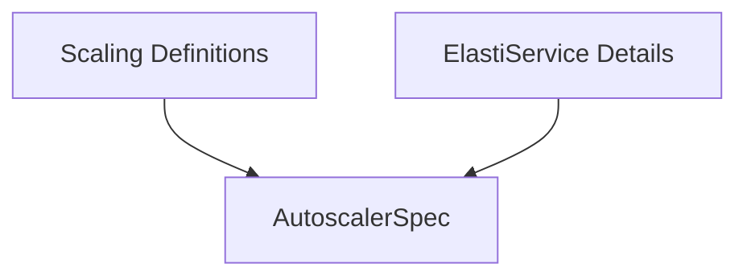

# Autoscaler Specifications Module

## Introduction

The `autoscaler_specifications` module defines the `AutoscalerSpec` structure, a crucial component for specifying the type and name of an autoscaler within the operator's custom resources. This module plays a vital role in enabling dynamic scaling capabilities for services managed by the operator.

## Core Functionality

The primary function of this module is to provide the `AutoscalerSpec` data structure. This structure is used to configure autoscaling for an `ElastiService` by defining the following:

- **Type**: Specifies the autoscaler mechanism to be used. Currently, supported types include "hpa" (Horizontal Pod Autoscaler) and "keda" (Kubernetes Event-driven Autoscaling).
- **Name**: Provides a unique identifier for the autoscaler instance.

### `AutoscalerSpec`

```go
type AutoscalerSpec struct {
	// +kubebuilder:validation:Enum=hpa;keda
	Type string `json:"type"`
	Name string `json:"name"`
}
```

## Architecture and Relationships

The `autoscaler_specifications` module is a leaf module that defines a key data structure used by other components within the operator. It is logically grouped under the `scaling_definitions` module, which encapsulates all scaling-related definitions.

The `AutoscalerSpec` structure is embedded within the `ElastiServiceSpec` (defined in the [elastiservice_details.md](elastiservice_details.md) module), which in turn is a part of the overall `ElastiService` custom resource. This relationship signifies that an `ElastiService` utilizes an `AutoscalerSpec` to declare its desired autoscaling behavior.

<!-- DIAGRAM_JSON
{
    "direction": "TD",
    "nodes": [
        {"id": "autoscaler_spec", "label": "AutoscalerSpec", "type": "component", "link": null},
        {"id": "scaling_definitions", "label": "Scaling Definitions", "type": "external", "link": "scaling_definitions.md"},
        {"id": "elastiservice_details", "label": "ElastiService Details", "type": "external", "link": "elastiservice_details.md"}
    ],
    "edges": [
        {"source": "scaling_definitions", "target": "autoscaler_spec"},
        {"source": "elastiservice_details", "target": "autoscaler_spec"}
    ],
    "groups": []
}
-->
