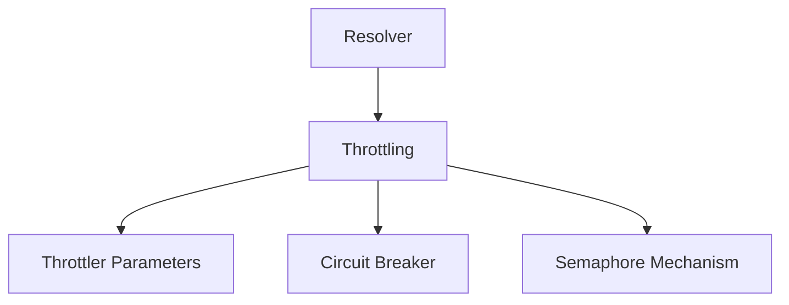

# Circuit Breaker Module

## Introduction
The `circuit_breaker` module is a crucial component within the `throttling` mechanism of the `resolver`. It implements the circuit breaker pattern, providing resilience and preventing cascading failures by stopping requests to services that are experiencing issues. This mechanism helps to maintain system stability and responsiveness during periods of instability.

## Architecture Overview
The circuit breaker module operates by monitoring the success and failure rates of operations. When the error rate crosses a predefined threshold, the circuit 'opens', stopping further requests to the failing service for a configurable duration. After this period, the circuit enters a 'half-open' state, allowing a limited number of test requests to determine if the service has recovered. If these test requests succeed, the circuit 'closes', resuming normal operation; otherwise, it 'opens' again.

This module primarily consists of the `Breaker` struct, which manages the state and logic of the circuit breaker, and `BreakerParams`, which configures its behavior. It integrates with the overall `throttling` system, interacting with semaphores and utilizing parameters defined at a higher level.

<!-- DIAGRAM_JSON
{
    "direction": "TD",
    "nodes": [
        {"id": "resolver", "label": "Resolver", "type": "module", "link": "resolver.md"},
        {"id": "throttling", "label": "Throttling", "type": "module", "link": "throttling.md"},
        {"id": "throttler_parameters", "label": "Throttler Parameters", "type": "module", "link": "throttler_parameters.md"},
        {"id": "circuit_breaker", "label": "Circuit Breaker", "type": "module", "link": "circuit_breaker.md"},
        {"id": "semaphore_mechanism", "label": "Semaphore Mechanism", "type": "module", "link": "semaphore_mechanism.md"}
    ],
    "edges": [
        {"source": "resolver", "target": "throttling"},
        {"source": "throttling", "target": "throttler_parameters"},
        {"source": "throttling", "target": "circuit_breaker"},
        {"source": "throttling", "target": "semaphore_mechanism"}
    ],
    "groups": []
}
-->

## Core Functionality

### Breaker
The `Breaker` struct is the heart of the circuit breaker implementation. It manages the current state of the circuit (closed, open, half-open) and controls the flow of requests.

**Components**:
*   `logger`: An instance of `zap.Logger` for logging events and debugging.
*   `inFlight`: An atomic counter (`atomic.Int64`) that tracks the number of requests currently being processed.
*   `totalSlots`: The total number of request slots available, typically derived from `maxConcurrency`.
*   `maxConcurrency`: The maximum number of concurrent requests allowed before the circuit breaker might open due to overload.
*   `sem`: A reference to a `semaphore` (from `semaphore_mechanism.md`) used to control the number of concurrent requests.

### BreakerParams
The `BreakerParams` struct defines the configurable parameters required to initialize a `Breaker` instance. These parameters allow operators to fine-tune the circuit breaker's behavior to suit specific service requirements.

**Components**:
*   `QueueDepth`: Specifies the maximum number of requests that can be queued while the circuit is in a certain state.
*   `MaxConcurrency`: Defines the maximum number of concurrent requests that the circuit breaker will allow. This is a critical parameter for preventing service overload.
*   `InitialCapacity`: Sets the initial capacity for certain internal structures within the breaker, affecting its startup performance.
*   `Logger`: An instance of `zap.Logger` to be used by the `Breaker` for logging purposes.

## Relationships to Other Modules
*   **Throttling Module (`throttling.md`)**: The `circuit_breaker` is an integral part of the `throttling` module, working in conjunction with other components like the `semaphore_mechanism` and `throttler_parameters` to manage overall request flow and system resilience.
*   **Semaphore Mechanism Module (`semaphore_mechanism.md`)**: The `Breaker` utilizes a `semaphore` (from `semaphore_mechanism.md`) to manage concurrent requests, ensuring that the number of in-flight operations does not exceed `maxConcurrency`.
*   **Throttler Parameters Module (`throttler_parameters.md`)**: Configuration for the `circuit_breaker` is often derived from or influenced by the parameters defined in the `throttler_parameters` module.
