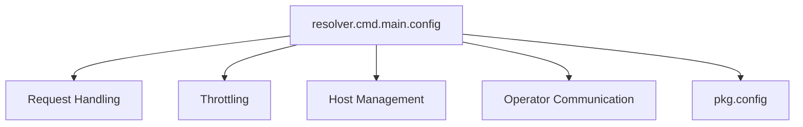

# configuration

The `configuration` module within the `resolver` service is responsible for defining and managing the operational parameters and settings that govern the resolver's behavior. It centralizes various configurable aspects, from network timeouts and connection pooling to queueing parameters and integration with external services like Sentry.

## Purpose and Core Functionality

The primary purpose of the `configuration` module is to provide a structured way to define and access runtime configuration values for the `resolver` service. These configurations are critical for tuning performance, managing resource utilization, and controlling the flow of requests.

The core component, `resolver.cmd.main.config`, is a Go struct that encapsulates all the configurable parameters. These include:

*   **Network Parameters**: `MaxIdleProxyConns`, `MaxIdleProxyConnsPerHost` (for connection pooling), `ReqTimeout` (for request timeouts).
*   **Operational Timers**: `TrafficReEnableDuration` (for host readiness checks), `OperatorRetryDuration` (for informing the operator), `QueueRetryDuration` (for retrying queued requests).
*   **Queue Management**: `QueueSize`, `MaxQueueConcurrency` (for the internal request queue).
*   **Resource Limits**: `InitialCapacity` (for semaphore-based concurrency control, relevant to [throttling](throttling.md)).
*   **Request Routing**: `HeaderForHost` (specifies the HTTP header used to identify the target host, relevant to [request_handling](request_handling.md) and [host_management](host_management.md)).
*   **Observability**: `SentryDsn`, `SentryEnv` (for integrating with Sentry for error tracking and monitoring).
*   **Protocol Settings**: `EnableH2C` (to enable HTTP/2 Cleartext).

By externalizing these parameters, the `configuration` module allows administrators and developers to easily adjust the resolver's behavior without code changes, facilitating deployment, scaling, and maintenance.

## Architecture and Component Relationships

The `configuration` module, primarily represented by the `config` struct, acts as a central repository for settings that permeate various other modules within the `resolver` service.

**Internal Components:**

*   `resolver.cmd.main.config`: The main configuration struct holding all the defined parameters.

**Relationships with other modules:**

*   **[request_handling](request_handling.md)**: Parameters like `ReqTimeout`, `QueueSize`, `MaxQueueConcurrency`, and `HeaderForHost` directly influence how incoming requests are processed, buffered, and routed.
*   **[throttling](throttling.md)**: The `InitialCapacity` parameter is crucial for configuring the semaphore used in the throttling mechanisms to control concurrent requests.
*   **[host_management](host_management.md)**: `TrafficReEnableDuration` and `HeaderForHost` are vital for managing host states, health checks, and routing decisions.
*   **[operator_communication](operator_communication.md)**: `OperatorRetryDuration` affects how frequently the resolver communicates host-related traffic information back to the operator.
*   **[pkg_config](pkg_config.md)**: While `resolver.cmd.main.config` defines application-specific runtime configurations, it likely works in conjunction with broader, shared configuration structures defined in the `pkg.config` module, which might provide foundational or generic configuration parameters for the entire system.

<!-- DIAGRAM_JSON
{
    "direction": "TD",
    "nodes": [
        {"id": "resolver_config", "label": "resolver.cmd.main.config", "type": "component", "link": null},
        {"id": "request_handling", "label": "Request Handling", "type": "external", "link": "request_handling.md"},
        {"id": "throttling", "label": "Throttling", "type": "external", "link": "throttling.md"},
        {"id": "host_management", "label": "Host Management", "type": "external", "link": "host_management.md"},
        {"id": "operator_communication", "label": "Operator Communication", "type": "external", "link": "operator_communication.md"},
        {"id": "pkg_config", "label": "pkg.config", "type": "external", "link": "pkg_config.md"}
    ],
    "edges": [
        {"source": "resolver_config", "target": "request_handling"},
        {"source": "resolver_config", "target": "throttling"},
        {"source": "resolver_config", "target": "host_management"},
        {"source": "resolver_config", "target": "operator_communication"},
        {"source": "resolver_config", "target": "pkg_config"}
    ],
    "groups": []
}
-->

## How the Module Fits into the Overall System

The `configuration` module is fundamental to the `resolver` service's operation within the broader system. It acts as the backbone for defining the `resolver`'s runtime characteristics, directly impacting its scalability, reliability, and performance.

By providing a clear and centralized configuration point, it ensures that the `resolver` can be deployed and operated effectively in various environments, adapting to different traffic loads, network conditions, and operational requirements. It forms a bridge between the system's operational policies and the `resolver`'s execution logic, allowing dynamic adjustments and consistent behavior across deployments.

For example, queue size and concurrency settings (defined here) directly influence the resolver's ability to absorb traffic spikes, while timeout values ensure graceful degradation under heavy load. The Sentry integration helps maintain system observability, crucial for quick incident response and continuous improvement.
