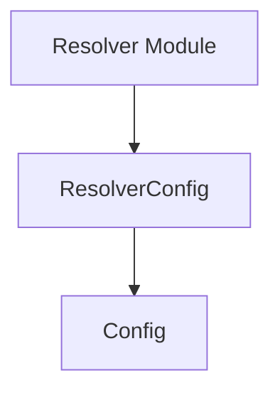

# configuration_definitions Module Documentation

## Introduction

The `configuration_definitions` module, located at `pkg/config/config.go`, defines the core data structures used for system-wide configuration. It provides foundational configuration parameters through the `Config` struct and extends them for specific components like the resolver service with the `ResolverConfig` struct. This module ensures consistency in configuration management across different parts of the system.

## Core Functionality and Components

This module defines two primary configuration structs:

### `Config`
The `Config` struct encapsulates general configuration parameters applicable to various services or deployments within the system.

```go
type Config struct {
	Namespace      string
	DeploymentName string
	ServiceName    string
	Port           int32
}
```

*   **`Namespace`**: Specifies the Kubernetes namespace where the service is deployed.
*   **`DeploymentName`**: The name of the Kubernetes Deployment resource.
*   **`ServiceName`**: The name of the Kubernetes Service resource.
*   **`Port`**: The primary port on which the service listens.

### `ResolverConfig`
The `ResolverConfig` struct extends the base `Config` struct, adding parameters specific to the resolver component. It demonstrates how specialized configurations can build upon general ones.

```go
type ResolverConfig struct {
	Config

	ReverseProxyPort int32
}
```

*   **`Config`**: Embeds the base `Config` struct, inheriting all its fields.
*   **`ReverseProxyPort`**: The port specifically used by the resolver's reverse proxy functionality.

## Architecture and Relationships

The `configuration_definitions` module serves as a central repository for defining the structure of configuration data. The `ResolverConfig` demonstrates an inheritance-like relationship by embedding the `Config` struct, promoting code reuse and modularity in configuration.

It is a leaf module within the `pkg.configuration.config_structures` hierarchy, providing the fundamental types that other modules, particularly the `resolver` module, utilize to initialize and manage their operational parameters.

<!-- DIAGRAM_JSON
{
    "direction": "TD",
    "nodes": [
        {"id": "config_struct", "label": "Config", "type": "component", "link": null},
        {"id": "resolver_config_struct", "label": "ResolverConfig", "type": "component", "link": null},
        {"id": "resolver_module", "label": "Resolver Module", "type": "external", "link": "resolver.md"}
    ],
    "edges": [
        {"source": "resolver_config_struct", "target": "config_struct", "label": "inherits"},
        {"source": "resolver_module", "target": "resolver_config_struct", "label": "uses"}
    ],
    "groups": []
}
-->


## How it Fits into the Overall System

The `configuration_definitions` module is critical for establishing a consistent and well-defined configuration schema across the entire system. Modules like `[resolver](resolver.md)` rely on these definitions to retrieve their operational settings. By centralizing these definitions, the system ensures that all components operate with agreed-upon parameters, simplifying deployment, management, and troubleshooting. It acts as a foundational layer for system initialization and runtime behavior customization.
