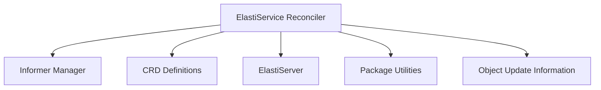

# Controller Logic Module

## Introduction

The `controller_logic` module is the core operational component of the operator, responsible for observing the desired state of `ElastiService` custom resources and reconciling it with the actual state in the Kubernetes cluster. It orchestrates the necessary actions to scale and manage services based on defined policies and triggers.

## Architecture Overview

The `controller_logic` module primarily contains the `ElastiServiceReconciler`, which is the central component for handling `ElastiService` custom resource reconciliation. It interacts with the `informer_manager` to set up watches on relevant Kubernetes resources and uses definitions from `crd_definitions` to understand the structure of `ElastiService` objects. The reconciler leverages the `elastiserver` for specific server-side operations and `pkg` for utility functions like scaling handlers.

<!-- DIAGRAM_JSON
{
    "direction": "TD",
    "nodes": [
        {"id": "reconciler", "label": "ElastiService Reconciler", "type": "module", "link": "reconciler.md"},
        {"id": "object_updater", "label": "Object Update Information", "type": "module", "link": "object_updater.md"},
        {"id": "informer_manager", "label": "Informer Manager", "type": "module", "link": "informer_manager.md"},
        {"id": "crd_definitions", "label": "CRD Definitions", "type": "module", "link": "crd_definitions.md"},
        {"id": "elastiserver", "label": "ElastiServer", "type": "module", "link": "elastiserver.md"},
        {"id": "pkg", "label": "Package Utilities", "type": "module", "link": "pkg.md"}
    ],
    "edges": [
        {"source": "reconciler", "target": "informer_manager"},
        {"source": "reconciler", "target": "crd_definitions"},
        {"source": "reconciler", "target": "elastiserver"},
        {"source": "reconciler", "target": "pkg"},
        {"source": "reconciler", "target": "object_updater"}
    ],
    "groups": []
}
-->

## Sub-modules

### [ElastiService Reconciler](reconciler.md)
Manages the reconciliation loop for ElastiService custom resources, ensuring the desired state matches the actual state in the Kubernetes cluster.

### [Object Update Information](object_updater.md)
Defines the structure for storing essential information about an object during an update operation, including replica counts and selectors.
