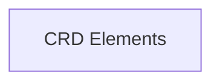

# CRD Data Structures Module Documentation

## Introduction
The `crd_data_structures` module defines the foundational Go data structures used to represent and manage Custom Resource Definitions (CRDs) within the operator. It provides the essential types for storing CRD metadata and their specifications and statuses, enabling the operator to effectively interact with Kubernetes custom resources.

## Architecture
The `crd_data_structures` module is a fundamental part of the `crd_directory` module, which is responsible for managing a directory of registered CRDs. This module specifically focuses on the Go types that define the structure of these CRDs and their associated data.

<!-- DIAGRAM_JSON
{
    "direction": "TD",
    "nodes": [
        {"id": "crd_elements", "label": "CRD Elements", "type": "module", "link": "crd_elements.md"}
    ],
    "edges": [],
    "groups": []
}
-->

## Sub-modules

### `crd_elements`
The `crd_elements` sub-module encapsulates the primary Go structs, `Directory` and `CRDDetails`, which are crucial for defining and managing the structure and state of Custom Resource Definitions within the operator. For more details, refer to the [crd_elements documentation](crd_elements.md).