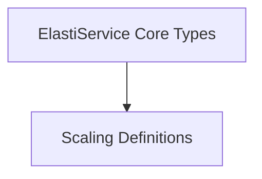

# CRD Definitions Module

## Introduction

The `crd_definitions` module is responsible for defining the Custom Resource Definitions (CRDs) for `ElastiService` within the operator. These CRDs establish the schema for how users interact with the ElastiService operator, allowing them to declare desired scaling behaviors and integrate with Kubernetes resources. This module provides the foundational data structures that represent the state and configuration of ElastiService resources in a Kubernetes cluster.

## Architecture Overview

The `crd_definitions` module is composed of several key sub-modules that collectively define the various aspects of the `ElastiService` Custom Resource. These sub-modules organize the different types and specifications, ensuring a clear and structured definition of the CRD.

<!-- DIAGRAM_JSON
{
    "direction": "TD",
    "nodes": [
        {"id": "elastiservice_core", "label": "ElastiService Core Types", "type": "module", "link": "elastiservice_core.md"},
        {"id": "scaling_definitions", "label": "Scaling Definitions", "type": "module", "link": "scaling_definitions.md"}
    ],
    "edges": [
        {"source": "elastiservice_core", "target": "scaling_definitions", "label": "includes"}
    ],
    "groups": []
}
-->

## Sub-modules

### ElastiService Core Types
This sub-module ([`elastiservice_core.md`](elastiservice_core.md)) defines the fundamental types for the `ElastiService` CRD, including the main `ElastiService` object, its specification (`ElastiServiceSpec`), its status (`ElastiServiceStatus`), and the `ElastiServiceList` for handling collections of these resources. It forms the backbone of the ElastiService custom resource.

### Scaling Definitions
This sub-module ([`scaling_definitions.md`](scaling_definitions.md)) encapsulates the definitions related to how scaling is managed for an `ElastiService`. It includes `ScaleTargetRef` for identifying the target resource to be scaled, `ScaleTrigger` for defining the conditions under which scaling should occur, and `AutoscalerSpec` for specifying the autoscaling mechanism.