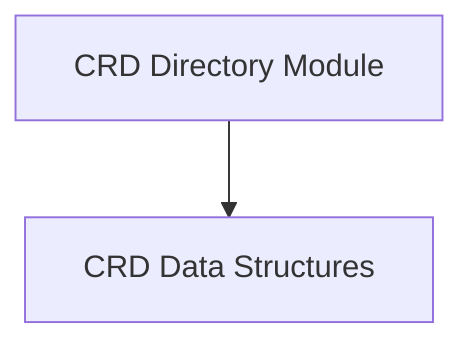

# CRD Directory Module

The `crd_directory` module is a crucial component within the `operator` that manages and organizes Custom Resource Definition (CRD) details. It provides a structured way to store and retrieve information about `ElastiService` CRDs, facilitating their efficient management and reconciliation.

## Architecture Overview

The `crd_directory` module primarily interacts with CRD definitions and serves as a central registry for `ElastiService` instances. It stores detailed information for each `ElastiService`, enabling other `operator` components, such as the `controller_logic` and `informer_manager`, to access current states and specifications.

<!-- DIAGRAM_JSON
{
    "direction": "TD",
    "nodes": [
        {"id": "crd_data_structures", "label": "CRD Data Structures", "type": "module", "link": "crd_data_structures.md"}
    ],
    "edges": [],
    "groups": []
}
-->

## Sub-modules

### [CRD Data Structures](crd_data_structures.md)
This sub-module defines the core data structures, `Directory` and `CRDDetails`, which are essential for storing and managing information about `ElastiService` Custom Resource Definitions (CRDs) within the operator.

