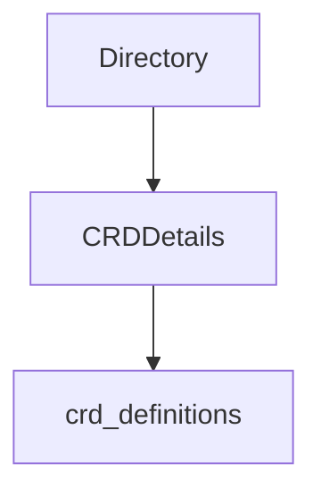

# Module: crd_elements

## Introduction

The `crd_elements` module is a fundamental part of the `operator.internal.crddirectory` package, responsible for defining the core data structures used to manage Custom Resource Definitions (CRDs) within the Kubernetes operator. Specifically, it provides the `Directory` for caching and accessing CRD-related information and `CRDDetails` for encapsulating the essential properties of an `ElastiService` CRD instance. This module underpins the operator's ability to track and reconcile custom resources.

## Architecture and Component Relationships

The `crd_elements` module contains two primary components that work in conjunction to manage CRD data:

### Directory

The `Directory` struct acts as a central repository or cache for various `ElastiService` instances. It uses a `sync.Map` to ensure thread-safe access to service information, making it suitable for concurrent operations within the operator. This component is crucial for quickly retrieving and updating the state of custom resources managed by the operator.

*   **`Services` (sync.Map)**: A concurrency-safe map that stores information related to `ElastiService` CRD instances. The exact type of value stored in this map would likely be `CRDDetails` or a similar structure containing CRD information.
*   **`Logger` (*zap.Logger)**: An instance of `zap.Logger` for structured, leveled logging within the directory operations.

### CRDDetails

The `CRDDetails` struct defines the essential properties of an individual `ElastiService` Custom Resource Definition. It encapsulates the CRD's name, its desired specification, and its observed status, providing a complete snapshot of a specific `ElastiService` instance.

*   **`CRDName` (string)**: The name of the Custom Resource Definition instance.
*   **`Spec` (v1alpha1.ElastiServiceSpec)**: The desired state or specification of the `ElastiService` as defined by the user. This type is further detailed in the [crd_definitions](crd_definitions.md) module.
*   **`Status` (v1alpha1.ElastiServiceStatus)**: The observed status or actual state of the `ElastiService` CRD instance. This type is also further detailed in the [crd_definitions](crd_definitions.md) module.

## How it Fits into the Overall System

The `crd_elements` module forms the backbone of the `crd_directory` subsystem, which is responsible for maintaining an up-to-date view of all `ElastiService` CRDs in the Kubernetes cluster. The `Directory` component serves as the primary data store that other parts of the operator, such as the `informer_manager` and `controller_logic`, query to get the current state of `ElastiService` resources. The `CRDDetails` structure provides the standardized format for this information, ensuring consistency across the system. It directly utilizes types defined in the `crd_definitions` module, making it an integral part of how `ElastiService` CRDs are defined and managed within the operator.

<!-- DIAGRAM_JSON
{
    "direction": "TD",
    "nodes": [
        {"id": "Directory", "label": "Directory", "type": "component", "link": null},
        {"id": "CRDDetails", "label": "CRDDetails", "type": "component", "link": null},
        {"id": "crd_definitions", "label": "crd_definitions", "type": "external", "link": "crd_definitions.md"}
    ],
    "edges": [
        {"source": "Directory", "target": "CRDDetails"},
        {"source": "CRDDetails", "target": "crd_definitions"}
    ],
    "groups": []
}
-->
