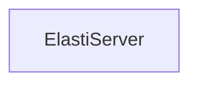

# ElastiServer

Provides an internal server to receive events from the Resolver module, triggering scale-up operations for services at zero replicas.

## Components

This module contains 1 component(s):

- `operator.internal.elastiserver.elastiServer.Server`

## Structure

---
*This documentation was auto-generated to ensure completeness.*
