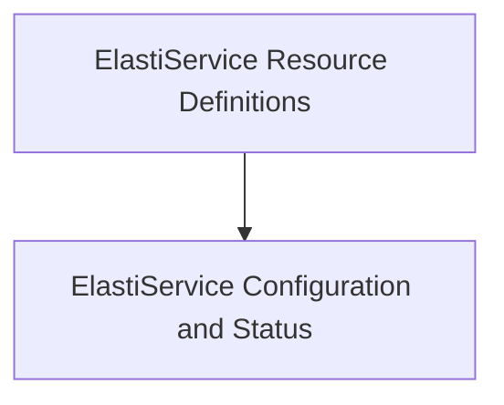

# ElastiService Core Module

## Introduction

The `elastiservice_core` module defines the fundamental Custom Resource Definitions (CRDs) for the ElastiService operator. It encompasses the core `ElastiService` resource, its desired specification (`Spec`), observed status (`Status`), and methods for listing these resources. This module is crucial for Kubernetes to understand and manage ElastiService instances, enabling dynamic scaling and management of target resources.

## Architecture Overview

The `elastiservice_core` module is structured to clearly separate the resource definitions from their detailed specifications and status. It provides the foundational types that other modules, such as `controller_logic` and `informer_manager`, interact with to reconcile and monitor ElastiService resources.

<!-- DIAGRAM_JSON
{
    "direction": "TD",
    "nodes": [
        {"id": "elastiservice_definitions", "label": "ElastiService Resource Definitions", "type": "module", "link": "elastiservice_definitions.md"},
        {"id": "elastiservice_details", "label": "ElastiService Configuration and Status", "type": "module", "link": "elastiservice_details.md"}
    ],
    "edges": [
        {"source": "elastiservice_definitions", "target": "elastiservice_details"}
    ],
    "groups": []
}
-->

## Sub-modules

### [ElastiService Resource Definitions](elastiservice_definitions.md)
This sub-module defines the `ElastiService` custom resource, which is the primary object managed by the operator, and `ElastiServiceList`, used for retrieving collections of ElastiService instances. These components provide the basic structure for Kubernetes to recognize and interact with ElastiService resources.

### [ElastiService Configuration and Status](elastiservice_details.md)
This sub-module includes `ElastiServiceSpec` and `ElastiServiceStatus`. `ElastiServiceSpec` outlines the desired configuration for an ElastiService, such as scaling targets, minimum replicas, cooldown periods, and scaling triggers. `ElastiServiceStatus` reflects the current operational state of an ElastiService instance, including last reconciliation time, last scaled-up time, and the current operational mode (e.g., "proxy" or "serve").