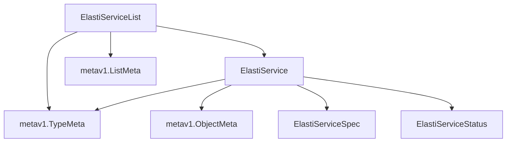

# elastiservice_definitions Module Documentation

The `elastiservice_definitions` module plays a crucial role in defining the core Kubernetes Custom Resource Definitions (CRDs) for managing `ElastiService` resources within the operator framework. This module specifically provides the Go struct definitions for `ElastiService` and `ElastiServiceList`, forming the fundamental schema for how these resources are represented and managed in Kubernetes.

## Core Functionality

This module encapsulates the definitions for the `ElastiService` custom resource and its corresponding list type. These definitions are essential for Kubernetes to understand and interact with `ElastiService` objects, enabling the operator to manage their lifecycle, scaling, and various operational aspects.

### ElastiService

The `ElastiService` struct represents a single instance of an ElastiService custom resource. It includes standard Kubernetes metadata and references to the `Spec` and `Status` of the ElastiService.

```go
type ElastiService struct {
	metav1.TypeMeta   `json:",inline"`
	metav1.ObjectMeta `json:"metadata,omitempty"`

	Spec   ElastiServiceSpec   `json:"spec,omitempty"`
	Status ElastiServiceStatus `json:"status,omitempty"`
}
```

-   `metav1.TypeMeta`: Embedded type that contains the API version and kind of the resource.
-   `metav1.ObjectMeta`: Embedded type for standard Kubernetes object metadata (e.g., name, namespace, labels, annotations).
-   `Spec`: Refers to the desired state of the `ElastiService`, defined in [elastiservice_details.md](elastiservice_details.md).
-   `Status`: Refers to the observed state of the `ElastiService`, defined in [elastiservice_details.md](elastiservice_details.md).

### ElastiServiceList

The `ElastiServiceList` struct is used for listing multiple `ElastiService` resources. It contains standard Kubernetes list metadata and an array of `ElastiService` objects.

```go
type ElastiServiceList struct {
	metav1.TypeMeta `json:",inline"`
	metav1.ListMeta `json:"metadata,omitempty"`
	Items           []ElastiService `json:"items"`
}
```

-   `metav1.TypeMeta`: Embedded type that contains the API version and kind of the list resource.
-   `metav1.ListMeta`: Embedded type for standard Kubernetes list metadata.
-   `Items`: An array containing a list of `ElastiService` objects.

## Architecture and Component Relationships

The `elastiservice_definitions` module serves as the foundational layer for `ElastiService` CRD interactions. It defines the basic structure that other components, such as the [elastiservice_controller](controller_logic.md) and the [crd_directory](crd_directory.md), rely on to process and manage these custom resources. It depends on `elastiservice_details` for the specifics of the `ElastiServiceSpec` and `ElastiServiceStatus`.

<!-- DIAGRAM_JSON
{
    "direction": "TD",
    "nodes": [
        {"id": "elastiservice", "label": "ElastiService", "type": "component", "link": null},
        {"id": "elastiservice_list", "label": "ElastiServiceList", "type": "component", "link": null},
        {"id": "elastiservice_spec", "label": "ElastiServiceSpec", "type": "external", "link": "elastiservice_details.md"},
        {"id": "elastiservice_status", "label": "ElastiServiceStatus", "type": "external", "link": "elastiservice_details.md"},
        {"id": "k8s_typemeta", "label": "metav1.TypeMeta", "type": "external", "link": null},
        {"id": "k8s_objectmeta", "label": "metav1.ObjectMeta", "type": "external", "link": null},
        {"id": "k8s_listmeta", "label": "metav1.ListMeta", "type": "external", "link": null}
    ],
    "edges": [
        {"source": "elastiservice", "target": "k8s_typemeta"},
        {"source": "elastiservice", "target": "k8s_objectmeta"},
        {"source": "elastiservice", "target": "elastiservice_spec"},
        {"source": "elastiservice", "target": "elastiservice_status"},
        {"source": "elastiservice_list", "target": "k8s_typemeta"},
        {"source": "elastiservice_list", "target": "k8s_listmeta"},
        {"source": "elastiservice_list", "target": "elastiservice"}
    ],
    "groups": []
}
-->


## How the Module Fits into the Overall System

The `elastiservice_definitions` module is a fundamental part of the `operator` system, specifically within the `crd_definitions` and `elastiservice_core` sub-modules. It provides the concrete Go types that represent the `ElastiService` custom resource, enabling:

-   **CRD Generation:** These definitions are used to generate the actual Kubernetes Custom Resource Definitions, allowing the Kubernetes API server to validate and persist `ElastiService` objects.
-   **API Interaction:** Other modules, such as the [controller_logic](controller_logic.md) and [informer_manager](informer_manager.md), use these types when interacting with the Kubernetes API to create, read, update, and delete `ElastiService` resources.
-   **Data Serialization/Deserialization:** These Go structs facilitate the serialization of `ElastiService` objects into JSON/YAML for API communication and their deserialization back into Go structs for processing within the operator.

By providing these foundational definitions, `elastiservice_definitions` ensures consistency and correctness in how `ElastiService` resources are handled throughout the entire operator system.
