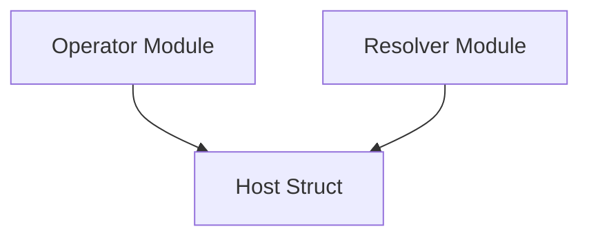

# host_go Module Documentation

## Introduction
The `host_go` module, residing within the `pkg.messages` package, defines the `Host` data structure. This module is a foundational component for representing detailed host-related information exchanged within the system, particularly concerning traffic management and service communication.

## Purpose and Core Functionality
The primary purpose of the `host_go` module is to provide a standardized data model for capturing host and traffic-related attributes. The `Host` struct encapsulates essential details required for various operations, including routing, traffic allowance decisions, and service identification.

### Core Components

#### `Host` Struct (`pkg.messages.host.Host`)
The `Host` struct is the central component of this module. It defines the following fields:
- `IncomingHost`: The hostname of the incoming request.
- `Namespace`: The Kubernetes namespace where the services are located.
- `SourceService`: The name of the service initiating the traffic.
- `TargetService`: The name of the service intended to receive the traffic.
- `SourceHost`: The hostname from which the traffic originates.
- `TargetHost`: The hostname to which the traffic is directed.
- `TrafficAllowed`: A boolean flag indicating whether the traffic is permitted.

This struct acts as a message format, enabling different parts of the system to communicate and make decisions based on comprehensive host and traffic context.

## Architecture and Component Relationships

The `host_go` module itself is a leaf module, primarily exposing the `Host` data structure. Its relationships are defined by how other modules utilize this data structure for their operations. Specifically, modules like `operator` and `resolver` are expected to consume or produce `Host` messages to facilitate their respective functionalities related to host management and traffic resolution.

<!-- DIAGRAM_JSON
{
    "direction": "TD",
    "nodes": [
        {"id": "host_struct", "label": "Host Struct", "type": "component", "link": null},
        {"id": "operator_module", "label": "Operator Module", "type": "external", "link": "operator.md"},
        {"id": "resolver_module", "label": "Resolver Module", "type": "external", "link": "resolver.md"}
    ],
    "edges": [
        {"source": "operator_module", "target": "host_struct"},
        {"source": "resolver_module", "target": "host_struct"}
    ],
    "groups": []
}
-->

## How the Module Fits into the Overall System
The `host_go` module provides a crucial data contract for host-related information within the system. It is integral to the messaging infrastructure, ensuring consistent representation of host and traffic details across various components.

- **Messaging:** The `Host` struct serves as a message payload, likely used by the `pkg.messages` parent module to define communication formats between different services.
- **Operator Module:** The [operator module](operator.md) likely uses the `Host` struct to manage and reconcile host-specific configurations and traffic rules within the Kubernetes environment.
- **Resolver Module:** The [resolver module](resolver.md) probably leverages the `Host` struct to resolve incoming requests, determine routing paths, and enforce traffic policies based on the provided host and service information.

By providing a clear and comprehensive definition of host attributes, `host_go` enables reliable and coherent data exchange, which is fundamental for the system's ability to manage and route network traffic effectively.