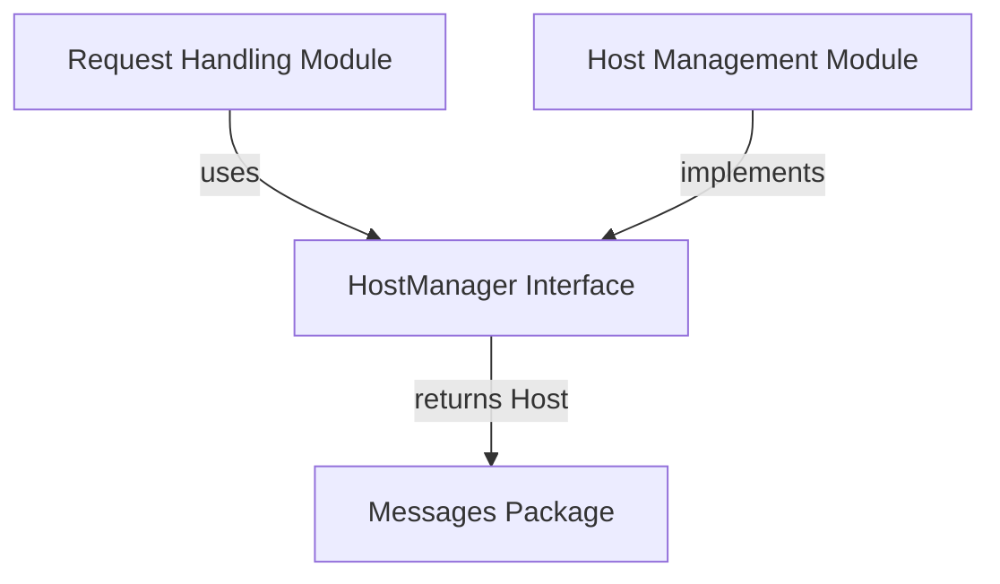

# host_manager_interface

## Introduction
The `host_manager_interface` module defines the `HostManager` interface, a crucial contract for managing backend hosts and their traffic within the `resolver` component. This interface abstracts the complexities of host selection and traffic control, allowing different implementations to be swapped without affecting the core request handling logic.

## Core Functionality
The `HostManager` interface provides methods for retrieving suitable hosts for incoming requests and for disabling traffic to specific hosts. This separation of concerns ensures that the request handling mechanism (e.g., `request_handling` module) can operate on a high level, delegating host-specific operations to a dedicated manager.

### `HostManager` Interface
The `HostManager` interface specifies the following methods:

```go
type HostManager interface {
    GetHost(req *http.Request) (*messages.Host, error)
    DisableTrafficForHost(service string)
}
```

*   **`GetHost(req *http.Request) (*messages.Host, error)`**:
    *   **Purpose**: Selects and returns an appropriate backend `Host` for a given incoming HTTP `Request`. This method is central to routing decisions.
    *   **Parameters**:
        *   `req *http.Request`: The incoming HTTP request for which a host needs to be identified.
    *   **Returns**:
        *   `*messages.Host`: A pointer to a `Host` object containing details about the selected backend, or `nil` if no suitable host is found.
        *   `error`: An error if host selection fails.
    *   **Dependencies**: This method interacts with the `pkg.messages.host.Host` type for its return value.
*   **`DisableTrafficForHost(service string)`**:
    *   **Purpose**: Instructs the host manager to stop sending traffic to hosts associated with a particular service. This is vital for maintenance, scaling down, or health check failures.
    *   **Parameters**:
        *   `service string`: The name of the service for which traffic should be disabled.

## Architecture and Component Relationships

The `host_manager_interface` module primarily defines the contract for host management. Its main component is the `HostManager` interface itself. This interface is consumed by the `request_handling` module (specifically, the `Handler` component) to perform host-related operations. The concrete implementation of this interface is provided by the `host_management` module.

<!-- DIAGRAM_JSON
{
    "direction": "TD",
    "nodes": [
        {"id": "HostManagerInterface", "label": "HostManager Interface", "type": "component", "link": null},
        {"id": "request_handling", "label": "Request Handling Module", "type": "external", "link": "request_handling.md"},
        {"id": "host_management", "label": "Host Management Module", "type": "external", "link": "host_management.md"},
        {"id": "pkg_messages", "label": "Messages Package", "type": "external", "link": "pkg.md"}
    ],
    "edges": [
        {"source": "request_handling", "target": "HostManagerInterface", "label": "uses"},
        {"source": "host_management", "target": "HostManagerInterface", "label": "implements"},
        {"source": "HostManagerInterface", "target": "pkg_messages", "label": "returns Host"}
    ],
    "groups": []
}
-->


## Integration with Overall System
This module plays a pivotal role in the `resolver`'s ability to intelligently route incoming requests. It establishes a clear boundary between the request processing logic and the underlying host selection and traffic control mechanisms. By defining a robust interface, it enables flexibility in how hosts are managed, whether through simple round-robin, sophisticated load balancing algorithms, or integration with external service discovery systems.

The `request_handling` module relies on this interface to get a target host for every incoming request. The `host_management` module provides the concrete logic that fulfills this interface, interacting with Kubernetes APIs or other mechanisms to maintain an updated view of available hosts.
