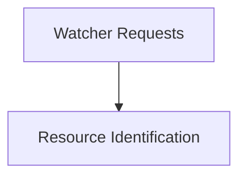

# Informer Manager Module

## Introduction
The `informer_manager` module is responsible for managing the lifecycle of Kubernetes informers within the operator. It provides the core mechanisms for watching specified Kubernetes resources, processing events (add, update, delete), and ensuring the efficient and reliable propagation of resource changes throughout the system. This module is crucial for maintaining an up-to-date cache of Kubernetes objects, enabling the operator to react promptly to changes in the cluster state.

## Architecture
The `informer_manager` module interacts with the Kubernetes API to establish watches on various resource types. It utilizes shared informers to reduce API server load and maintain a local, synchronized cache of objects. When changes occur, these informers trigger registered event handlers, allowing the operator's controllers to reconcile the desired state with the actual cluster state.

<!-- DIAGRAM_JSON
{
    "direction": "TD",
    "nodes": [
        {"id": "watcher_requests", "label": "Watcher Requests", "type": "module", "link": "watcher_requests.md"},
        {"id": "resource_identification", "label": "Resource Identification", "type": "module", "link": "resource_identification.md"}
    ],
    "edges": [
        {"source": "watcher_requests", "target": "resource_identification"}
    ],
    "groups": []
}
-->

## Sub-modules Overview

### [Watcher Requests](watcher_requests.md)
This sub-module defines the structure for requests used to establish watches on Kubernetes resources. It encapsulates details necessary for an informer to monitor specific resource types, including the resource's group, version, and kind, along with the event handlers that will process changes.

### [Resource Identification](resource_identification.md)
The `resource_identification` sub-module provides critical parameters for uniquely identifying Kubernetes resources. It defines the structure used to pinpoint specific resources within a cluster, facilitating targeted operations and event processing by informers and controllers.
