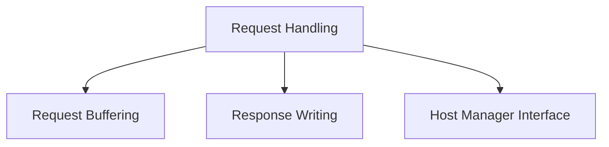

# Internal Request Processing Module

## Introduction

The `internal_request_processing` module is a core component within the `resolver` system, specifically handling the low-level mechanics of processing incoming HTTP requests and preparing outgoing HTTP responses. It focuses on efficient resource utilization through buffer pooling, abstracting host management interactions, and facilitating detailed response introspection.

## Architecture Overview

This module integrates closely with the broader `request_handling` component, providing fundamental building blocks for managing data flow and communication with backend services. It defines interfaces and utility structures that enable the `resolver` to efficiently handle network traffic and interact with managed hosts. Its primary responsibilities include:

*   **Request Buffering**: Optimizing memory usage for HTTP request and response bodies.
*   **Response Writing**: Capturing and managing HTTP response details.
*   **Host Management Interface**: Defining how to interact with the host management layer.

<!-- DIAGRAM_JSON
{
    "direction": "TD",
    "nodes": [
        {"id": "request_handling", "label": "Request Handling", "type": "module", "link": "request_handling.md"},
        {"id": "request_buffering", "label": "Request Buffering", "type": "module", "link": "request_buffering.md"},
        {"id": "response_writing", "label": "Response Writing", "type": "module", "link": "response_writing.md"},
        {"id": "host_manager_interface", "label": "Host Manager Interface", "type": "module", "link": "host_manager_interface.md"}
    ],
    "edges": [
        {"source": "request_handling", "target": "request_buffering"},
        {"source": "request_handling", "target": "response_writing"},
        {"source": "request_handling", "target": "host_manager_interface"}
    ],
    "groups": []
}
-->

## Sub-modules

This module is composed of the following sub-modules, each addressing a specific aspect of internal request processing:

*   ### [Request Buffering](request_buffering.md)
    This sub-module (`request_buffering`) is responsible for managing a pool of `bytes.Buffer` objects using `sync.Pool`. This mechanism is crucial for minimizing memory allocations and garbage collection overhead during frequent handling of HTTP request and response bodies, leading to improved performance and efficiency of the resolver.

*   ### [Response Writing](response_writing.md)
    The `response_writing` sub-module encapsulates the functionality for writing HTTP responses. It wraps the standard `http.ResponseWriter` to allow for introspection and modification of the response, such as capturing the HTTP status code and the response body. This is essential for logging, metrics collection, and potential response transformation.

*   ### [Host Manager Interface](host_manager_interface.md)
    This sub-module (`host_manager_interface`) defines the `HostManager` interface that the `Handler` uses to interact with the host management layer. It provides methods for retrieving a suitable host for a given request and for disabling traffic to a specific host. This abstraction allows the core request processing logic to remain decoupled from the specific implementation details of host selection and management, which are handled by the [Host Management module](host_management.md).