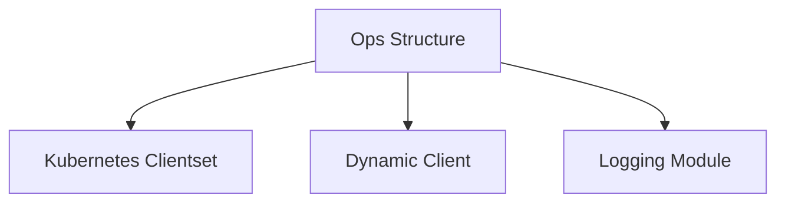

# k8s_helper Module Documentation

## Introduction

The `k8s_helper` module provides a set of utility functions and structures for interacting with the Kubernetes API. It encapsulates the core Kubernetes client functionalities, offering a streamlined way for other modules to perform Kubernetes-related operations.

## Core Functionality and Purpose

The primary component of this module is the `Ops` struct, which serves as a wrapper for Kubernetes API clients:

-   **`Ops` Struct**:
    -   `kClient *kubernetes.Clientset`: An instance of `kubernetes.Clientset` which is used for standard Kubernetes API operations (e.g., managing deployments, services, pods, etc., for well-known API types).
    -   `kDynamicClient *dynamic.DynamicClient`: An instance of `dynamic.DynamicClient` which allows interaction with custom resources (CRDs) and other Kubernetes resources whose types are not known at compile time. This is crucial for working with custom controllers and operators.
    -   `logger *zap.Logger`: An integrated logger for outputting operational logs and debugging information, likely leveraging the [logging module](logging.md) for consistent logging practices across the system.

This module acts as a foundational layer, abstracting the complexities of direct Kubernetes API interactions and providing a consistent interface for other system components.

## Architecture and Component Relationships

The `k8s_helper` module primarily consists of the `Ops` struct, which relies on external Kubernetes client libraries and the internal logging module.

<!-- DIAGRAM_JSON
{
    "direction": "TD",
    "nodes": [
        {"id": "ops_component", "label": "Ops Structure", "type": "component", "link": null},
        {"id": "kubernetes_clientset", "label": "Kubernetes Clientset", "type": "external", "link": "https://pkg.go.dev/k8s.io/client-go/kubernetes"},
        {"id": "dynamic_client", "label": "Dynamic Client", "type": "external", "link": "https://pkg.go.dev/k8s.io/client-go/dynamic"},
        {"id": "logging_module", "label": "Logging Module", "type": "external", "link": "logging.md"}
    ],
    "edges": [
        {"source": "ops_component", "target": "kubernetes_clientset"},
        {"source": "ops_component", "target": "dynamic_client"},
        {"source": "ops_component", "target": "logging_module"}
    ],
    "groups": []
}
-->

## How it fits into the overall system

The `k8s_helper` module is a critical infrastructure component. It provides the necessary tools for any part of the system that needs to interact with the Kubernetes cluster, whether it's managing standard resources or custom resources (CRDs). For example, the `operator` module, which likely manages custom resources defined in `operator.api.v1alpha1.elastiservice_types`, would extensively use the functionalities provided by `k8s_helper` to reconcile the state of these resources within Kubernetes. Similarly, the `resolver` module, if it needs to dynamically discover or manage services within Kubernetes, would also rely on this helper. By centralizing Kubernetes interaction logic, `k8s_helper` ensures consistency and simplifies the development of Kubernetes-aware components.
