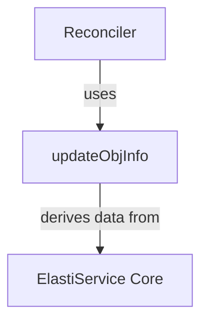

# Object Updater Module Documentation

The `object_updater` module plays a crucial role within the operator's controller logic by defining a data structure essential for managing and tracking updates to Kubernetes objects, particularly custom resources like `ElastiService`.

### Purpose and Core Functionality

The primary purpose of the `object_updater` module is to provide the `updateObjInfo` struct. This struct serves as a concise container for critical information required to process updates for a given object within the Kubernetes cluster. It encapsulates details such as the desired number of replicas (from the specification), the current number of replicas (from the status), a selector to identify associated resources, and the object's namespace and name.

This centralized data structure helps the operator's controller efficiently compare the desired state with the current state and perform necessary reconciliation actions.

### Architecture and Component Relationships

The `object_updater` module is a leaf module within the `controller_logic` component of the `operator`. It contains a single core component, `updateObjInfo`, which is a Go struct.

The `updateObjInfo` struct is primarily utilized by the `reconciler` module (specifically, the `ElastiServiceReconciler`) to store transient information about an `ElastiService` object during a reconciliation loop. The data populated into an `updateObjInfo` instance, such as `specReplicas`, `statusReplicas`, `namespace`, and `name`, directly originates from the definitions found within the `elastiservice_core` module, which defines the `ElastiService` Custom Resource Definition (CRD).

<!-- DIAGRAM_JSON
{
    "direction": "TD",
    "nodes": [
        {"id": "update_obj_info", "label": "updateObjInfo", "type": "component", "link": null},
        {"id": "reconciler", "label": "Reconciler", "type": "external", "link": "reconciler.md"},
        {"id": "elastiservice_core", "label": "ElastiService Core", "type": "external", "link": "elastiservice_core.md"}
    ],
    "edges": [
        {"source": "reconciler", "target": "update_obj_info", "label": "uses"},
        {"source": "update_obj_info", "target": "elastiservice_core", "label": "derives data from"}
    ],
    "groups": []
}
-->

### How it Fits into the Overall System

In the broader context of the operator, the `object_updater` module provides a fundamental data abstraction for managing object state. The `ElastiServiceReconciler` (part of the `reconciler` module) is responsible for monitoring `ElastiService` custom resources and ensuring their actual state matches their desired state. During this process, the `reconciler` will extract relevant information from an `ElastiService` object's specification and status and store it in an `updateObjInfo` instance. This instance then serves as a working copy of the object's critical update parameters, streamlining the logic for scaling, status updates, and other reconciliation tasks.

It acts as a lightweight, internal representation of an object's update-related properties, allowing the controller to perform its reconciliation logic without constantly querying the full Kubernetes object.