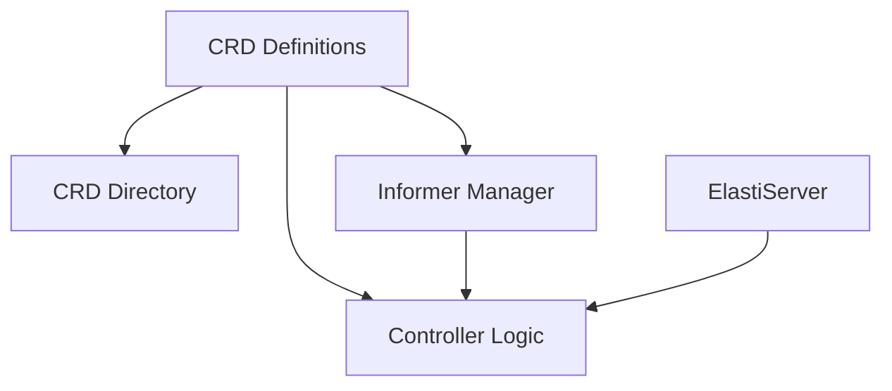

# Operator Module Documentation

The `operator` module is the core component responsible for managing the lifecycle and scaling of Kubernetes resources based on custom `ElastiService` definitions. It implements the Kubernetes operator pattern, extending the platform's capabilities to automate scaling decisions for various workloads.

## Architecture Overview

The `operator` module is structured into several key sub-modules, each handling a specific aspect of the operator's functionality. These sub-modules work in concert to watch for changes in `ElastiService` resources, reconcile their desired state, and initiate scaling actions when necessary.

<!-- DIAGRAM_JSON
{
    "direction": "TD",
    "nodes": [
        {"id": "crd_definitions", "label": "CRD Definitions", "type": "module", "link": "crd_definitions.md"},
        {"id": "crd_directory", "label": "CRD Directory", "type": "module", "link": "crd_directory.md"},
        {"id": "informer_manager", "label": "Informer Manager", "type": "module", "link": "informer_manager.md"},
        {"id": "controller_logic", "label": "Controller Logic", "type": "module", "link": "controller_logic.md"},
        {"id": "elastiserver", "label": "ElastiServer", "type": "module", "link": "elastiserver.md"}
    ],
    "edges": [
        {"source": "crd_definitions", "target": "crd_directory"},
        {"source": "crd_definitions", "target": "informer_manager"},
        {"source": "crd_definitions", "target": "controller_logic"},
        {"source": "informer_manager", "target": "controller_logic"},
        {"source": "elastiserver", "target": "controller_logic"}
    ],
    "groups": []
}
-->

## Sub-modules

*   ### [CRD Definitions](crd_definitions.md)
    This module defines the Custom Resource Definitions (CRDs) for `ElastiService`, including specifications for scaling targets, triggers, and autoscalers. These types are fundamental for how the operator interacts with Kubernetes.

*   ### [CRD Directory](crd_directory.md)
    The `crd_directory` module manages a directory of `ElastiService` CRDs, storing their specifications and statuses for quick lookup and management within the operator.

*   ### [ElastiServer](elastiserver.md)
    The `elastiserver` module provides an internal server designed to receive communication from the `resolver` module or other future components. It uses these events to trigger scale-up operations for services that are currently at zero replicas.

*   ### [Informer Manager](informer_manager.md)
    The `informer_manager` module handles the lifecycle of Kubernetes informers, which are responsible for watching for changes in Kubernetes resources. It facilitates event-driven operations by notifying other components of resource updates.

*   ### [Controller Logic](controller_logic.md)
    The `controller_logic` module implements the core reconciliation logic for `ElastiService` resources. It is responsible for managing scaling, updating resource statuses, and overseeing the overall lifecycle of controlled resources within the Kubernetes cluster.
