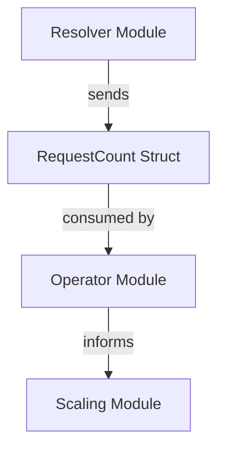

# operator_go Module Documentation

The `operator_go` module, residing within `pkg.messages`, defines the core data structures used for communicating request count information within the system, specifically targeting the main `operator` module. Its primary purpose is to provide a standardized format for representing and transmitting the number of requests associated with a particular service and namespace.

## Core Functionality

The `operator_go` module primarily exposes the `RequestCount` struct. This struct serves as a fundamental message type for relaying demand metrics to the operator for further processing, such as autoscaling decisions.

### RequestCount

```go
type RequestCount struct {
        Count     int    `json:"count"`
        Svc       string `json:"svc"`
        Namespace string `json:"namespace"`
}
```

The `RequestCount` struct contains the following fields:
-   `Count`: An integer representing the number of requests.
-   `Svc`: A string identifying the name of the service associated with the request count.
-   `Namespace`: A string indicating the Kubernetes namespace where the service resides.

## Architecture and Component Relationships

The `operator_go` module is a leaf module that defines a critical data structure for inter-module communication. While it doesn't contain complex logic itself, the `RequestCount` struct is instrumental in bridging the `resolver`, `operator`, and `scaling` modules.

<!-- DIAGRAM_JSON
{
    "direction": "TD",
    "nodes": [
        {"id": "request_count", "label": "RequestCount Struct", "type": "component", "link": null},
        {"id": "operator_module", "label": "Operator Module", "type": "external", "link": "operator.md"},
        {"id": "resolver_module", "label": "Resolver Module", "type": "external", "link": "resolver.md"},
        {"id": "scaling_module", "label": "Scaling Module", "type": "external", "link": "scaling.md"}
    ],
    "edges": [
        {"source": "resolver_module", "target": "request_count", "label": "sends"},
        {"source": "request_count", "target": "operator_module", "label": "consumed by"},
        {"source": "operator_module", "target": "scaling_module", "label": "informs"}
    ],
    "groups": []
}
-->


### Relationships

-   **[Resolver Module](resolver.md)**: The `resolver` module is responsible for collecting request metrics and then serializing them into `RequestCount` messages, which are subsequently sent to the `operator`.
-   **[Operator Module](operator.md)**: The main `operator` module consumes these `RequestCount` messages. It uses the `Count`, `Svc`, and `Namespace` information to monitor service load and make decisions, such as triggering autoscaling actions.
-   **[Scaling Module](scaling.md)**: The `operator` module, after processing the `RequestCount` messages, might interact with the `scaling` module (e.g., [pkg.scaling.scale_handler.ScaleHandler](scaling.md)) to adjust the number of replicas for services based on the observed request load.
