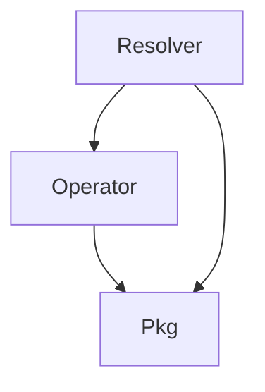

The KubeElasti repository provides a Kubernetes-native autoscaling solution designed to manage the lifecycle and dynamic scaling of services. It leverages custom resource definitions (CRDs) to allow users to define flexible scaling policies. The system comprises an `operator` to enforce these policies within the Kubernetes cluster, a `resolver` component to handle incoming traffic, apply throttling, and trigger scaling events (especially for services that need to scale from zero replicas), and a `pkg` module that offers foundational utilities and shared logic across the entire system.

### Architecture Overview

The KubeElasti repository is structured around three main modules: `Operator`, `Resolver`, and `Pkg`. The `Resolver` handles incoming requests and communicates with the `Operator` to initiate scaling actions. Both the `Operator` and `Resolver` rely on the `Pkg` module for shared functionalities like Kubernetes helpers, scaling logic, and configuration management.

