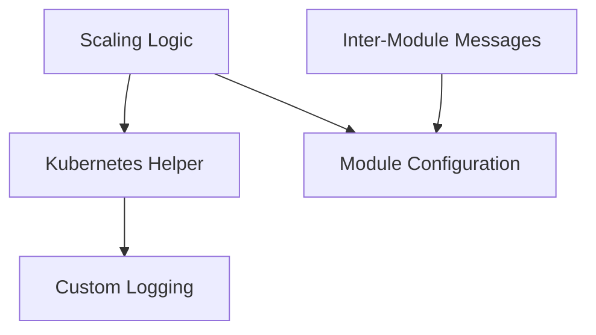

# Pkg Module Documentation

## Introduction

The `pkg` module serves as a foundational library within the system, encapsulating core functionalities related to Kubernetes interactions, scaling mechanisms, configuration management, inter-module messaging, and custom logging. It provides essential abstractions and utilities that are consumed by other higher-level modules, such as `operator` and `resolver`.

## Architecture Overview

The `pkg` module is composed of several key sub-modules, each responsible for a distinct set of functionalities. These sub-modules are designed to be loosely coupled, allowing for independent development and easier maintenance.

<!-- DIAGRAM_JSON
{
    "direction": "TD",
    "nodes": [
        {"id": "scaling", "label": "Scaling Logic", "type": "module", "link": "scaling.md"},
        {"id": "k8s_helper", "label": "Kubernetes Helper", "type": "module", "link": "k8s_helper.md"},
        {"id": "configuration", "label": "Module Configuration", "type": "module", "link": "configuration.md"},
        {"id": "messages", "label": "Inter-Module Messages", "type": "module", "link": "messages.md"},
        {"id": "logging", "label": "Custom Logging", "type": "module", "link": "logging.md"}
    ],
    "edges": [
        {"source": "scaling", "target": "k8s_helper"},
        {"source": "scaling", "target": "configuration"},
        {"source": "messages", "target": "configuration"},
        {"source": "k8s_helper", "target": "logging"}
    ],
    "groups": []
}
-->

## Sub-modules

### [Scaling Logic](scaling.md)
This sub-module manages horizontal scaling operations, including defining scaler interfaces and implementing specific scalers like Prometheus. It contains the logic and components necessary for determining when and how to scale services.

### [Kubernetes Helper](k8s_helper.md)
The Kubernetes Helper sub-module provides utility functions and clients for interacting with the Kubernetes API. It simplifies common Kubernetes operations, making it easier for other parts of the system to manage resources.

### [Module Configuration](configuration.md)
This sub-module defines configuration structures for the module, including general settings and resolver-specific configurations. It centralizes configuration management, ensuring consistency across the system.

### [Inter-Module Messages](messages.md)
The Inter-Module Messages sub-module defines data structures used for communication between different components and modules, such as request counts and host information. It establishes a standardized way for components to exchange data.

### [Custom Logging](logging.md)
This sub-module implements custom logging functionalities, extending standard logging frameworks. It provides tailored logging capabilities to enhance observability and debugging within the system.
