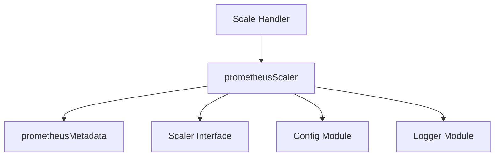

# Prometheus Implementation Module

The `prometheus_implementation` module provides the concrete implementation for scaling resources based on metrics retrieved from a Prometheus monitoring system. It defines the necessary data structures and logic to configure and execute scaling operations driven by Prometheus queries.

## Core Functionality

This module encapsulates the following core functionalities:
- **Prometheus Metadata Definition**: Defines the structure for Prometheus-specific configuration, including the Prometheus server address, query, threshold for scaling, and optional headers for requests.
- **Prometheus Scaler**: Implements the actual scaling logic by interacting with a Prometheus server. It uses the defined metadata to construct queries, fetch metrics, and determine if scaling actions (up or down) are required based on the configured threshold.

## Architecture and Component Relationships

The `prometheus_implementation` module is a leaf module within the `pkg.scaling.scalers` package. It contains two primary components: `prometheusMetadata` and `prometheusScaler`. The `prometheusScaler` utilizes `prometheusMetadata` for its configuration and is designed to conform to the `Scaler` interface defined in the `scaler_interface` module. It is typically used by the `ScaleHandler` from the `scale_handler` module to orchestrate scaling events.

<!-- DIAGRAM_JSON
{
    "direction": "TD",
    "nodes": [
        {"id": "prometheus_metadata", "label": "prometheusMetadata", "type": "component", "link": null},
        {"id": "prometheus_scaler", "label": "prometheusScaler", "type": "component", "link": null},
        {"id": "scaler_interface", "label": "Scaler Interface", "type": "external", "link": "scaler_interface.md"},
        {"id": "scale_handler", "label": "Scale Handler", "type": "external", "link": "scale_handler.md"},
        {"id": "config", "label": "Config Module", "type": "external", "link": "configuration.md"},
        {"id": "logger", "label": "Logger Module", "type": "external", "link": "logging.md"}
    ],
    "edges": [
        {"source": "prometheus_scaler", "target": "prometheus_metadata"},
        {"source": "prometheus_scaler", "target": "scaler_interface", "label": "implements"},
        {"source": "scale_handler", "target": "prometheus_scaler", "label": "uses"},
        {"source": "prometheus_scaler", "target": "config", "label": "uses"},
        {"source": "prometheus_scaler", "target": "logger", "label": "uses"}
    ],
    "groups": []
}
-->



### Component Details

#### `prometheusMetadata`
(Defined in `pkg/scaling/scalers/prometheus_scaler.go`)

```go
type prometheusMetadata struct {
	ServerAddress string            `json:"serverAddress"`
	Query         string            `json:"query"`
	Threshold     float64           `json:"threshold,string"`
	UptimeFilter  string            `json:"uptimeFilter"`
	Headers       map[string]string `json:"headers"`
}
```
This struct defines the configuration parameters required for a Prometheus-based scaler.
- `ServerAddress`: The URL of the Prometheus server.
- `Query`: The PromQL query to execute for retrieving metrics.
- `Threshold`: The value against which the query result will be compared to trigger scaling.
- `UptimeFilter`: An optional filter to consider the uptime of targets in the query.
- `Headers`: Custom HTTP headers to be included in requests to the Prometheus server.

#### `prometheusScaler`
(Defined in `pkg/scaling/scalers/prometheus_scaler.go`)

```go
type prometheusScaler struct {
	httpClient           *http.Client
	metadata             *prometheusMetadata
	cooldownPeriod       time.Duration
	defaultServerAddress string
	defaultHeaders       map[string]string
}
```
The `prometheusScaler` struct represents the Prometheus scaler itself. It holds the necessary components and configuration to interact with Prometheus.
- `httpClient`: An HTTP client used to make requests to the Prometheus server.
- `metadata`: A pointer to `prometheusMetadata` which contains the specific configuration for the current scaling target.
- `cooldownPeriod`: A duration specifying how long to wait between scaling actions to prevent rapid, consecutive scaling.
- `defaultServerAddress`: A default Prometheus server address, potentially used if `metadata.ServerAddress` is not provided.
- `defaultHeaders`: Default HTTP headers to be used if no specific headers are provided in the `metadata`.

## Integration with the Overall System

The `prometheus_implementation` module plays a crucial role in the system's dynamic scaling capabilities. It provides a specialized scaler that integrates with Prometheus, a widely used monitoring solution.

- **Pluggable Scaling**: By implementing the [Scaler Interface](scaler_interface.md), `prometheusScaler` can be seamlessly integrated into the scaling framework, allowing the system to use Prometheus as one of many possible metrics sources for autoscaling.
- **Dynamic Resource Management**: It enables the system to automatically adjust the number of running instances for services based on real-time metrics (e.g., CPU utilization, request rate) collected by Prometheus.
- **Configuration**: It relies on the [Config Module](configuration.md) for overall system configuration and uses the [Logger Module](logging.md) for logging its operations and any encountered issues.
- **Orchestration**: The [Scale Handler Module](scale_handler.md) is responsible for coordinating with `prometheusScaler` to trigger scaling events based on the evaluation of Prometheus metrics.
