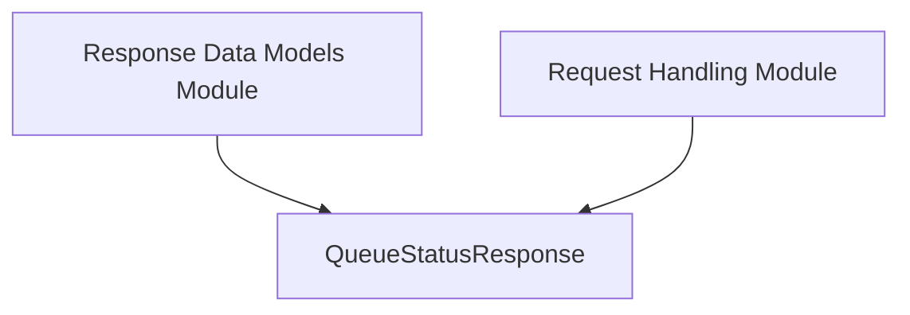

# queue_status Module Documentation

The `queue_status` module is a vital component within the `resolver` service, specifically designed to encapsulate the status of request queues. It defines the data structure used to communicate the current queue status, which is crucial for the resolver's ability to manage and respond to incoming requests effectively.

## Core Functionality

The primary responsibility of the `queue_status` module is to provide a standardized format for reporting queue status information. It defines the `QueueStatusResponse` struct, which is used across various components of the `resolver` to convey the operational status of request queues. This enables other modules, particularly those involved in request handling and throttling, to make informed decisions based on the current load and availability of resources.

## Architecture and Component Relationships

The `queue_status` module, through its `QueueStatusResponse` component, serves as a data model within the larger `response_data_models` module. It is directly utilized by the `request_handling` module, which processes incoming requests and generates responses. The `QueueStatusResponse` is a simple yet critical data structure that facilitates communication about queue state throughout the resolver's internal architecture.

<!-- DIAGRAM_JSON
{
    "direction": "TD",
    "nodes": [
        {"id": "queue_status_response", "label": "QueueStatusResponse", "type": "component", "link": null},
        {"id": "response_data_models", "label": "Response Data Models Module", "type": "external", "link": "response_data_models.md"},
        {"id": "request_handling", "label": "Request Handling Module", "type": "external", "link": "request_handling.md"}
    ],
    "edges": [
        {"source": "response_data_models", "target": "queue_status_response"},
        {"source": "request_handling", "target": "queue_status_response"}
    ],
    "groups": []
}
-->

### Component Breakdown

*   **QueueStatusResponse**:
    *   **File**: `resolver/internal/handler/handler.go`
    *   **Description**: This Go struct defines the format for a queue status response. It contains a single integer field, `QueueStatus`, which represents the current status or depth of a processing queue. This simple structure ensures efficient and clear communication of queue state within the resolver.

## How the Module Fits into the Overall System

The `queue_status` module is integral to the `resolver`'s operational efficiency and responsiveness. By providing a clear and consistent mechanism for reporting queue status, it enables:

*   **Load Management**: The `request_handling` module can use the `QueueStatusResponse` to monitor the load on internal queues, allowing it to adapt its processing strategies or inform upstream components about system capacity.
*   **Throttling Decisions**: While not directly part of the `throttling` module, the information provided by `QueueStatusResponse` can indirectly influence throttling decisions by providing insight into the system's ability to handle new requests.
*   **Health Monitoring**: External monitoring systems or other modules within the `resolver` can query for queue status using this response structure to assess the overall health and performance of the service.

This module plays a foundational role in maintaining the stability and performance of the `resolver` by facilitating critical internal communication regarding resource availability.
