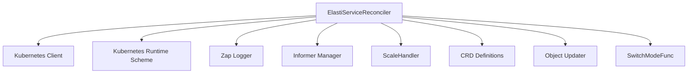

The `reconciler` module plays a central role in the operator's control plane, responsible for observing, analyzing, and acting upon `ElastiService` custom resources within the Kubernetes cluster. It embodies the core reconciliation loop, ensuring the desired state of `ElastiService` resources matches the actual cluster state.

### `reconciler` Module Documentation

The primary component within the `reconciler` module is `ElastiServiceReconciler`, which implements the Kubernetes controller-runtime's `Reconciler` interface. This component is tasked with handling all events related to `ElastiService` objects, orchestrating scaling operations, managing informers, and maintaining the overall health and desired state of services.

#### Core Functionality

The `ElastiServiceReconciler` struct is defined as follows:

```go
type (
	SwitchModeFunc          func(ctx context.Context, req ctrl.Request, mode string) (res ctrl.Result, err error)
	ElastiServiceReconciler struct {
		client.Client
		Scheme             *kRuntime.Scheme
		Logger             *zap.Logger
		InformerManager    *informer.Manager
		SwitchModeLocks    sync.Map
		ScaleHandler       *scaling.ScaleHandler
		InformerStartLocks sync.Map
		ReconcileLocks     sync.Map
	}
)
```

**Key Responsibilities:**

*   **Kubernetes API Interaction:** Utilizes `client.Client` to perform CRUD operations on Kubernetes resources, fetching `ElastiService` objects, and updating their status.
*   **Scheme Management:** Employs `*kRuntime.Scheme` for proper serialization and deserialization of Kubernetes objects, ensuring type safety and compatibility.
*   **Logging:** Integrates `*zap.Logger` for structured and efficient logging, crucial for debugging and operational visibility.
*   **Informer Management:** Interacts with the [informer_manager](informer_manager.md) module (`*informer.Manager`) to set up watches on `ElastiService` and other relevant resources. This allows the reconciler to receive notifications about changes in the cluster state without constantly polling the API server.
*   **Concurrency Control:** Uses `sync.Map` instances (`SwitchModeLocks`, `InformerStartLocks`, `ReconcileLocks`) to manage concurrent reconciliation requests, mode switching, and informer startup, preventing race conditions and ensuring data consistency.
*   **Scaling Operations:** Delegates actual scaling logic to `*scaling.ScaleHandler` (from the `pkg` module), which abstracts away the complexities of interacting with various scaling mechanisms.
*   **Mode Switching:** The `SwitchModeFunc` type hints at a mechanism for the reconciler to operate in different modes, potentially for different operational phases or fault tolerance scenarios.

#### Architecture and Component Relationships

The `ElastiServiceReconciler` acts as the orchestrator, bringing together various internal and external components to fulfill its reconciliation duties.

<!-- DIAGRAM_JSON
{
    "direction": "TD",
    "nodes": [
        {"id": "reconciler_component", "label": "ElastiServiceReconciler", "type": "component", "link": null},
        {"id": "switch_mode_func", "label": "SwitchModeFunc", "type": "component", "link": null},
        {"id": "k8s_client", "label": "Kubernetes Client", "type": "external", "link": null},
        {"id": "k8s_scheme", "label": "Kubernetes Runtime Scheme", "type": "external", "link": null},
        {"id": "zap_logger", "label": "Zap Logger", "type": "external", "link": null},
        {"id": "informer_manager", "label": "Informer Manager", "type": "external", "link": "informer_manager.md"},
        {"id": "scale_handler", "label": "ScaleHandler", "type": "external", "link": "pkg.md"},
        {"id": "crd_definitions", "label": "CRD Definitions", "type": "external", "link": "crd_definitions.md"},
        {"id": "object_updater", "label": "Object Updater", "type": "external", "link": "object_updater.md"}
    ],
    "edges": [
        {"source": "reconciler_component", "target": "k8s_client"},
        {"source": "reconciler_component", "target": "k8s_scheme"},
        {"source": "reconciler_component", "target": "zap_logger"},
        {"source": "reconciler_component", "target": "informer_manager"},
        {"source": "reconciler_component", "target": "scale_handler"},
        {"source": "reconciler_component", "target": "crd_definitions"},
        {"source": "reconciler_component", "target": "object_updater"},
        {"source": "reconciler_component", "target": "switch_mode_func"}
    ],
    "groups": []
}
-->


#### Integration with the Overall System

The `reconciler` module is a fundamental part of the `operator` module's `controller_logic`. It acts as the brain of the operator, continuously comparing the desired state (defined by `ElastiService` CRDs) with the current state of the cluster.

*   **`informer_manager`**: The `ElastiServiceReconciler` relies heavily on the [informer_manager](informer_manager.md) to watch for changes in `ElastiService` resources and other related Kubernetes objects. This allows the reconciler to react promptly to updates, creations, and deletions.
*   **`crd_definitions`**: The `ElastiServiceReconciler` operates directly on `ElastiService` custom resources, which are defined within the [crd_definitions](crd_definitions.md) module. It understands the structure and semantics of `ElastiServiceSpec` and `ElastiServiceStatus` to perform its reconciliation logic.
*   **`pkg` (Scaling Handlers)**: For executing scaling actions, the `ElastiServiceReconciler` delegates to the `ScaleHandler` provided by the [pkg](pkg.md) module. This separation of concerns allows the reconciler to focus on control logic while the `pkg` module handles the specifics of interacting with various scaling mechanisms (e.g., Prometheus scaler).
*   **`object_updater`**: The reconciler often needs to update the status of `ElastiService` objects in Kubernetes. It likely leverages functionality from the [object_updater](object_updater.md) module (which contains `updateObjInfo`) to persist the observed state and any operational outcomes back to the `ElastiService` status field.
*   **`elastiserver`**: While not directly shown as a dependency in the `ElastiServiceReconciler` struct itself, the `elastiserver` module, which contains the `elastiServer.Server` component, might expose an API or service that the reconciler interacts with for advanced elasticity management or internal state synchronization.
*   **`resolver`**: The `resolver` module is likely a consumer of the `operator`'s actions. After the `reconciler` scales up or down resources, the `resolver` would pick up these changes to properly route traffic or manage hosts.
