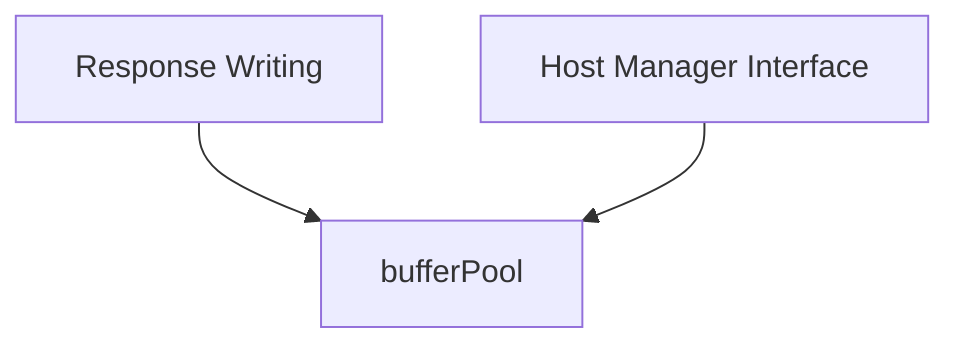

# request_buffering Module Documentation

The `request_buffering` module is a crucial component within the `resolver` system, specifically designed to optimize memory usage and improve performance by managing a pool of reusable buffers. It underpins efficient request and response handling by reducing the overhead associated with frequent memory allocations and deallocations.

## Purpose and Core Functionality

The primary purpose of the `request_buffering` module is to provide a `bufferPool` for other components within the `resolver` to draw upon. This pool of pre-allocated buffers minimizes garbage collection cycles and improves the speed at which requests are processed and responses are generated.

Its core functionality revolves around the `bufferPool` component:

*   **`bufferPool`**: This component encapsulates a `sync.Pool`, a Go primitive designed for managing a pool of temporary objects that can be reused. It allows other parts of the system to acquire a buffer when needed and return it to the pool once it's no longer in use, instead of allocating a new buffer each time. This is particularly beneficial in high-throughput scenarios where many small buffers might be frequently created and destroyed.

## Architecture and Component Relationships

The `request_buffering` module is a leaf module under `internal_request_processing`, which itself is part of `request_handling` within the broader `resolver` module. Its architecture is straightforward, with the `bufferPool` being its sole internal component. It acts as a utility provider for its sibling modules and parent components that require efficient memory management for their operations.

<!-- DIAGRAM_JSON
{
    "direction": "TD",
    "nodes": [
        {"id": "buffer_pool", "label": "bufferPool", "type": "component", "link": null},
        {"id": "response_writing", "label": "Response Writing", "type": "external", "link": "response_writing.md"},
        {"id": "host_manager_interface", "label": "Host Manager Interface", "type": "external", "link": "host_manager_interface.md"}
    ],
    "edges": [
        {"source": "response_writing", "target": "buffer_pool"},
        {"source": "host_manager_interface", "target": "buffer_pool"}
    ],
    "groups": []
}
-->

As illustrated in the diagram:
*   **`bufferPool`**: This is the core component of the `request_buffering` module, providing a mechanism for efficient buffer reuse.
*   **`Response Writing`**: The `response_writing` module, responsible for generating and sending responses, likely utilizes the `bufferPool` to obtain buffers for constructing response data.
*   **`Host Manager Interface`**: The `host_manager_interface` module, which interacts with host management functionalities, may also leverage the `bufferPool` for various internal operations related to host communication or data handling.

## How the Module Fits into the Overall System

The `request_buffering` module is an essential part of the `resolver`'s performance optimization strategy. By offering a shared pool of buffers, it significantly reduces the memory footprint and CPU overhead associated with dynamic memory allocation.

In the context of the `resolver` system:
*   It serves the `internal_request_processing` sub-module by providing a fundamental utility for memory management.
*   It directly supports components like `response_writing` and `host_manager_interface` by supplying them with efficient buffers, thereby improving the overall speed and resource utilization of request and response handling.
*   This module contributes to the `resolver`'s ability to handle a high volume of requests with low latency, making the entire system more robust and scalable. It is a behind-the-scenes hero that ensures smooth and efficient data flow within the request processing pipeline.