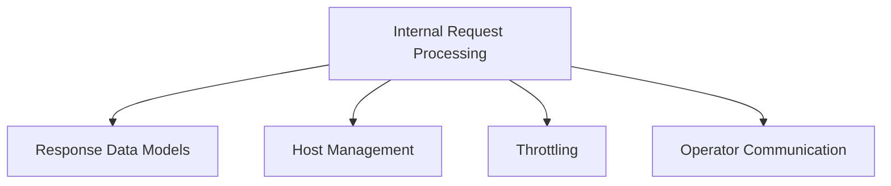

# Request Handling Module

## Introduction

The `request_handling` module is a core component within the `resolver` service, responsible for processing incoming HTTP requests, managing response structures, and interacting with various internal services like host management and throttling. It acts as the central point for orchestrating how requests are received, processed, and responded to within the resolver's architecture.

## Architecture Overview

The `request_handling` module interfaces with several other key modules, including `host_management` for host selection and traffic control, `throttling` for rate limiting and circuit breaking, and `operator_communication` for sending request information to the operator. It defines the fundamental structures for handling requests and responses, ensuring efficient and robust communication within the system.

<!-- DIAGRAM_JSON
{
    "direction": "TD",
    "nodes": [
        {"id": "internal_request_processing", "label": "Internal Request Processing", "type": "module", "link": "internal_request_processing.md"},
        {"id": "response_data_models", "label": "Response Data Models", "type": "module", "link": "response_data_models.md"},
        {"id": "host_management", "label": "Host Management", "type": "module", "link": "host_management.md"},
        {"id": "throttling", "label": "Throttling", "type": "module", "link": "throttling.md"},
        {"id": "operator_communication", "label": "Operator Communication", "type": "module", "link": "operator_communication.md"}
    ],
    "edges": [
        {"source": "internal_request_processing", "target": "response_data_models"},
        {"source": "internal_request_processing", "target": "host_management"},
        {"source": "internal_request_processing", "target": "throttling"},
        {"source": "internal_request_processing", "target": "operator_communication"}
    ],
    "groups": []
}
-->

## Sub-modules

### [Internal Request Processing](internal_request_processing.md)
This sub-module focuses on the core mechanics of handling requests, including buffer management (`bufferPool`), custom response writing (`responseWriter`), and defining the interface for host management (`HostManager`) that allows the handler to interact with the [Host Management module](host_management.md).

### [Response Data Models](response_data_models.md)
This sub-module defines the structured data formats used for responses sent back to clients. It includes general purpose `Response` objects and `QueueStatusResponse` for conveying queue-related information.
